<h1 align="center"> HTB Machine Writeup Season 4 </h1>

  

This repository collects the writeups of the machines that I solved during "*Season 4*" of HTB. Even though I started the season already, I reached the **Ruby** rank.

    <a href="https://labs.hackthebox.com/achievement/season/805273/4">
        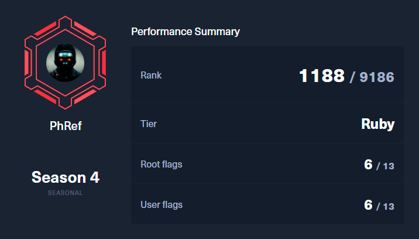
    </a>

## Machines Pwned

    <a href="/Machines/Bizness/README.md">
        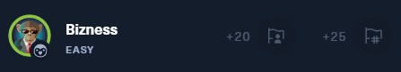
    </a>

    <a href="/Machines/Monitored/README.md">
        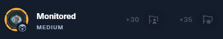
    </a>

    <a href="/Machines/Pov/README.md">
        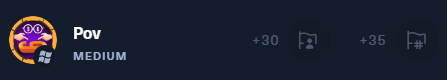
    </a>

    <a href="/Machines/Crafty/README.md">
        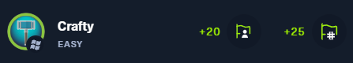
    </a>

    <a href="/Machines/Office/README.md">
        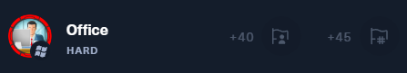
    </a>

    <a href="/Machines/Jab/README.md">
        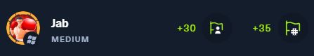
    </a>

    <a href="/Machines/Perfection/README.md">
        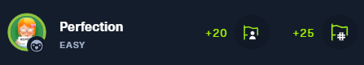
    </a>

    <a href="/Machines/FormulaX/README.md">
        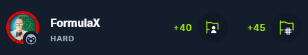
    </a>

    <a href="/Machines/WifineticTwo/README.md">
        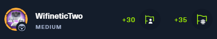
    </a>

    <a href="/Machines/Headless/README.md">
        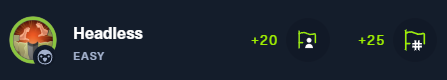
    </a>

